# dart基础语法

### 1 变量、常量声明

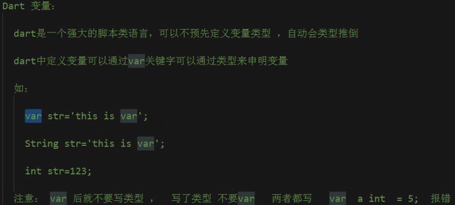

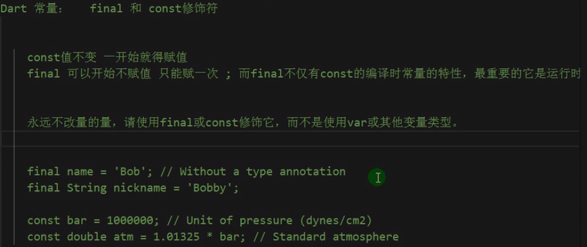

```dart
// final是运行时常量，并且final是惰性初始化，即在运行时第一次使用前才初始化
final a = new DateTime.now();
print(a);
```


### 2 数据类型

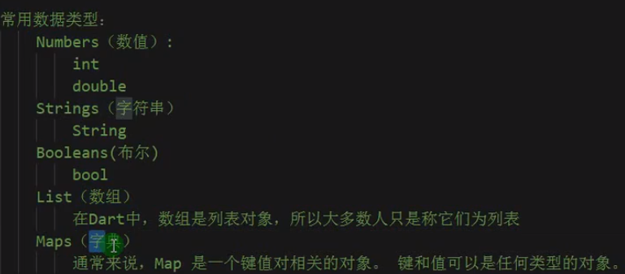

#### 字符串String

```dart
  // 定义多行字符串
  String name = '''
  lrr
  is
  student
  ''';
  print(name);
```

```dart
// 字符串拼接
  String name = 'lrr';
  String age = '24';
  print("$name $age");  // print输出String不需要占位符，直接使用$取到变量
// 等价于
  print(name + " " + age);  
```


#### 数值类型

```dart
// int
int a=23;
print(a);

// double
double b=12.12;
print(b);

var c=a+b;
print(c);
```


#### bool类型

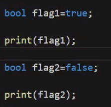

打印出来的就是true或者false。


#### List（数组/集合）

```dart
// 第一种定义方式
var l1=['lrr',20,true];
print(l1.length);  // 获取长度
print(l1[1]);  // 获取对应下标的元素
l1.add("nima");  // 使用[]创建的List动态增加元素

// 第二种定义方式  指定类型
var l2=<String>["lrr","kk"];
l2.add("tt");

---------------------------------------------------------------

// 第三种定义方式
var l3=List.filled(2,"");  // 长度（长度不可修改了），初始化元素（实际上也指定了数据类型是String）  
var l4=List<String>.filled(2,"");  // 指定类型
```


#### Map

```dart
// 第一种定义方式
var m1={
    "name":"lrr",   // 键必须加引号
    "age":123
};
print(m1["name"]);

// 第二种定义方式
var p=new Map();
p["name"]="lrr";
print(p["name"]);
```


#### is关键字

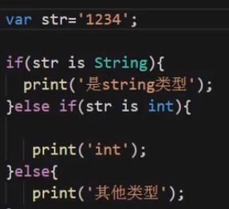


### 3 运算符 条件判断 类型转换

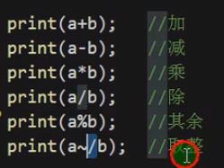

#### 赋值运算符

除了=，还有??=。

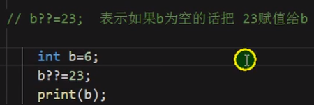

#### 条件表达式

```dart
  var sex = "男";

  switch (sex) {
    case "男":
      print("boy");
      break;
    case "女":
      print("girl");
      break;
    default:
      print("error");
      break;
  }
```

#### ??运算符

```dart
var a=22;
b=a??10;
print(b);  // 如果a是空的，那么将??后面的值赋给b，否则将a赋给b
```

#### 类型转换

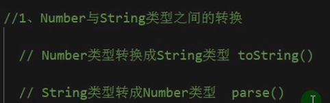

```dart
  String name = '123';
  var number = double.parse(name);
  print(number);
```

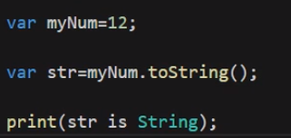

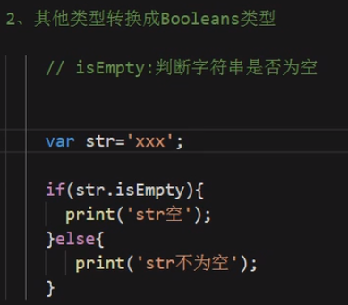

空是**null**。


### 4 循环语句

```dart
  List l1 = <int>[];
  for (int i = 0; i < 3; i++) {
    l1.add(i * 2);
  }
  print(l1);
```

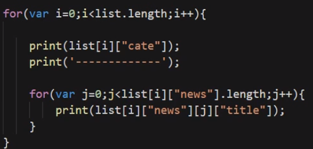


### 5 List Set Map详解

#### List

常用的属性

```dart
length
isEmpty
reversed  // 返回的不是List类型，需要使用toList()方法转换
```

常用的方法：

```dart
add
addAll  // 拼接数组
indexOf  // 查找，找到返回索引，否则返回-1
remove
removeAll
fillRange(start,end,'new String')   // 不包含end位置 
insert
insertAll
toList  // 其他类型转换为List
join  // List转换为字符串
split  // 字符串转换为List
```

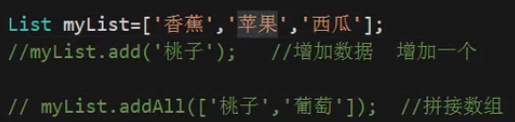

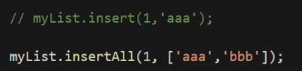

```dart
  List l1 = ['lrr', 'ouyuan'];
  var res = l1.join('-');
  print(res);
  List l2 = res.split('-');
  print(l2);
```

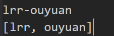


#### Set

不能有重复的键。

```dart
  List myList = ['nima', 'shabi', 'nima'];
  var s = new Set();
  s.addAll(myList);  // 去重
  print(s.toList());
```


#### Map

定义方法：

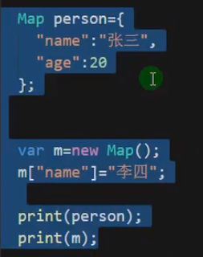

增加多个键值：

addAll({

​	"name":"lrr"

})

删除：

remove("key")

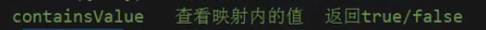


#### 可迭代对象的循环

```dart
  List myList = ['nima', 'shabi', 'nima'];
  for (var iter in myList) {  // 和oc种的增强for一样
    print(iter);
  }

// forEach
  List myList = ['nima', 'shabi', 'nima'];
  myList.forEach((value){
      print(value);
  });

// map 主要用于修改值
  List myList = [1,2,3];
  List newList = myList.map((value){
      return value*2;
  });
  print(newList.toList());
```

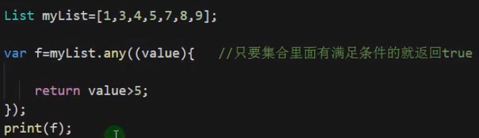


### 6 函数

类型可以不写，但是不建议，最好还是写一下。


#### 可选参数

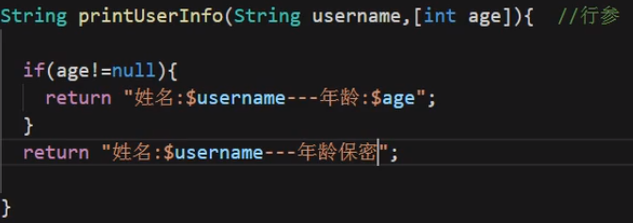

```dart
  String printInfo(String name, [int age]) {
    if (age != null) {
      return "$name:$age";
    }
    return "$name:年龄未知";
  }

  print(printInfo("lrr"));
```

#### 默认参数

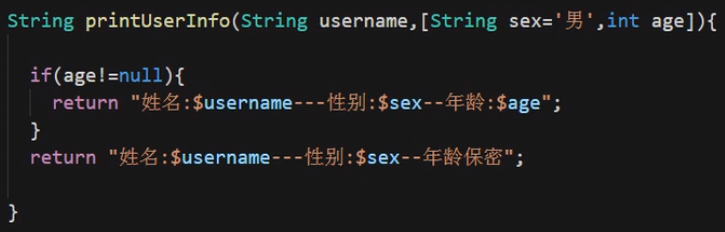

#### 命名参数

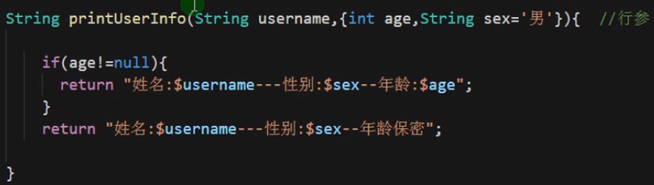

使用大括号{}，注意和可选参数[]区别。

使用时指定参数名：

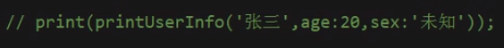

#### 方法作为参数

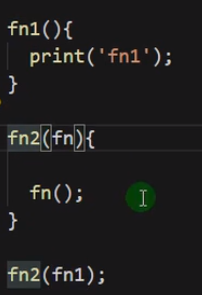

#### 匿名函数

```dart
  var fn = () {  // 可以有参数
    print("hello world");
  };
  fn();
```

#### 箭头函数

函数体只有一条语句。

```dart
  List myList = ['nima', 'shabi', 'nima'];
  myList.forEach((value) => print(value));
```

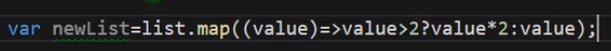

#### 自执行方法

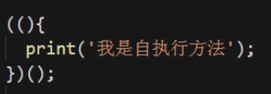

```dart
  ((int n) {
    print(n);
  })(12);
```


### 7 闭包

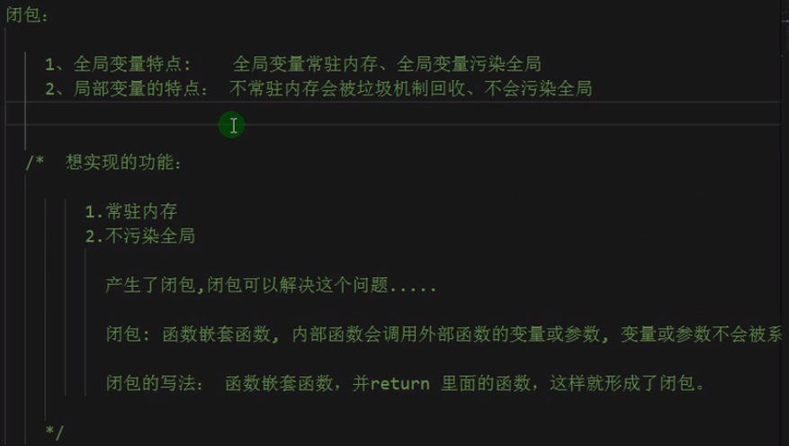

闭包写法：

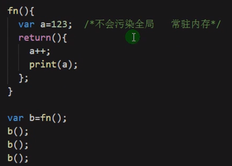

类似局部静态变量。

```dart
 fn () {
    var a = 123;
    return () {  // 不会污染全局，常驻内存
      a++;
      print(a);
    };
  };
// 等价
var fn = () {
    var a = 123;
    return () {  // 不会污染全局，常驻内存
      a++;
      print(a);
    };
  };
 
  var b = fn();  // 返回的是匿名函数，必须用变量接收
  b();
  b();
```


### 8 类

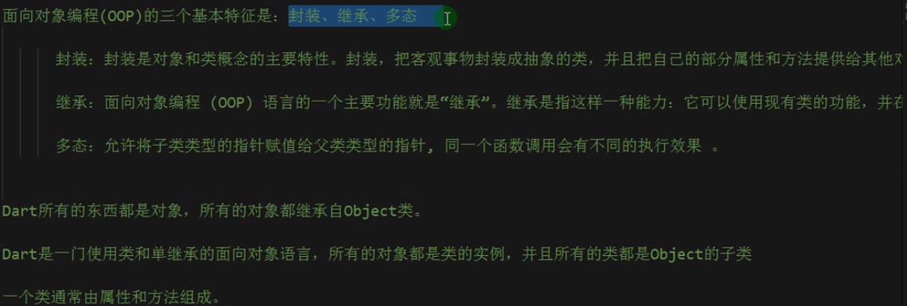

#### 类的定义

```dart
class Person {
  String name = "lrr";
  int age = 24;
  void printInfo() {
    print("${this.name}---${this.age}");
  }
}


class Person {
  String name;
  int age;
  void printInfo() {
    print("${this.name}---${this.age}");
  }

  // 默认构造函数，只能有一个
  Person(String name, int age) {
    this.name = name;
    this.age = age;
  }
  // 简写
  // Person(this.name,this.age);
    
  // 命名构造函数，可以有多个
  Person.now(){
      print("我是命名构造函数");
  }
  Person.setInfo(String name,int age){
      this.name=name;
      this.age=age;
  }
}

main(){
    Person p=new Person.now();
    Person p2=new Person.setInfo("lrr",24);
    p1.printInfo();
}
```


#### 将类单独抽离为一个类

```dart
将类单独写在一个类中
假设在lib文件夹下
    
在另一个使用该类的文件中使用import
import 'lib/Person.dart';
```


#### 访问修饰符

```dart
将类抽离为单独的一个文件，并且属性名前加上下划线，才能实现私有属性
// Person.dart
class Person {
  String _name;
  int age;
  void printInfo() {
    print("${this._name}---${this.age}");
  }

  // 默认构造函数
  Person(String name, int age) {
    this._name = name;
    this.age = age;
  }

  void _run() {
    print('这是一个私有方法');
  }

  execRun() {
    this._run();
  }
}

// main.dart
import 'Person.dart';

void main() {
  Person p = new Person("lrr", 24);
  // print(p._name);  // 不能访问
  p.printInfo();
  p.execRun();
}
```


#### getter和setter

```dart
class Rect {
  int height;
  int width;
  Rect(this.height, this.width);

  // area() {
  //   return this.height * this.width;
  // }
  // 等价的getter写法
  get area {
    return this.height * this.width;
  }

  set setHeight(value) {
    this.height = value;
  }
}

void main() {
  Rect r = new Rect(10, 4);
  print(r.area);
  r.setHeight = 6;
  print(r.area);
}
```


#### 初始化列表

```dart
class Rect {
  int height;
  int width;
  Rect():height=2,width=4;

  area() {
    return this.height * this.width;
  }
}

main(){
    Rect r = new Rect();
    print(r.area());
}
```


#### 静态成员


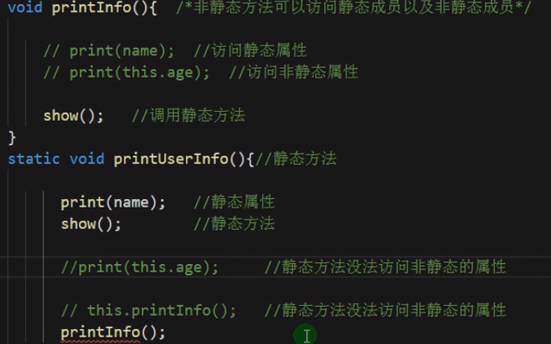

静态方法只能通过类名直接调用，不能通过实例化的对象直接调用。

可以在类中使用非静态方法去调用静态方法。


# flutter知识

