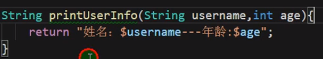
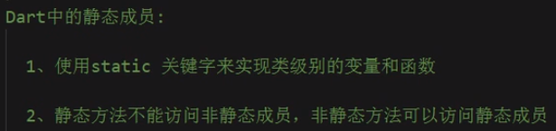
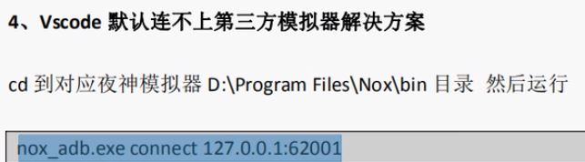

# dart基础语法

### 1 变量、常量声明


```dart
// final是运行时常量，并且final是惰性初始化，即在运行时第一次使用前才初始化
final a = new DateTime.now();
print(a);
```


### 2 数据类型


#### 字符串String

```dart
  // 定义多行字符串
  String name = '''
  lrr
  is
  student
  ''';
  print(name);
```

```dart
// 字符串拼接
  String name = 'lrr';
  String age = '24';
  print("$name $age");  // print输出String不需要占位符，直接使用$取到变量
// 等价于
  print(name + " " + age);  
```


#### 数值类型

```dart
// int
int a=23;
print(a);

// double
double b=12.12;
print(b);

var c=a+b;
print(c);
```


#### bool类型


打印出来的就是true或者false。


#### List（数组/集合）

```dart
// 第一种定义方式
var l1=['lrr',20,true];
print(l1.length);  // 获取长度
print(l1[1]);  // 获取对应下标的元素
l1.add("nima");  // 使用[]创建的List动态增加元素

// 第二种定义方式  指定类型
var l2=<String>["lrr","kk"];
l2.add("tt");

---------------------------------------------------------------

// 第三种定义方式
var l3=List.filled(2,"");  // 长度（长度不可修改了），初始化元素（实际上也指定了数据类型是String）  
var l4=List<String>.filled(2,"");  // 指定类型
```


#### Map

```dart
// 第一种定义方式
var m1={
    "name":"lrr",   // 键必须加引号
    "age":123
};
print(m1["name"]);

// 第二种定义方式
var p=new Map();
p["name"]="lrr";
print(p["name"]);
```


#### is关键字


### 3 运算符 条件判断 类型转换


#### 赋值运算符

除了=，还有??=。


#### 条件表达式

```dart
  var sex = "男";

  switch (sex) {
    case "男":
      print("boy");
      break;
    case "女":
      print("girl");
      break;
    default:
      print("error");
      break;
  }
```

#### ??运算符

```dart
var a=22;
b=a??10;
print(b);  // 如果a是空的，那么将??后面的值赋给b，否则将a赋给b
```

#### 类型转换


```dart
  String name = '123';
  var number = double.parse(name);
  print(number);
```


空是**null**。


### 4 循环语句

```dart
  List l1 = <int>[];
  for (int i = 0; i < 3; i++) {
    l1.add(i * 2);
  }
  print(l1);
```


### 5 List Set Map详解

#### List

常用的属性

```dart
length
isEmpty
reversed  // 返回的不是List类型，需要使用toList()方法转换
```

常用的方法：

```dart
add
addAll  // 拼接数组
indexOf  // 查找，找到返回索引，否则返回-1
remove
removeAll
fillRange(start,end,'new String')   // 不包含end位置 
insert
insertAll
toList  // 其他类型转换为List
join  // List转换为字符串
split  // 字符串转换为List
```


```dart
  List l1 = ['lrr', 'ouyuan'];
  var res = l1.join('-');
  print(res);
  List l2 = res.split('-');
  print(l2);
```


#### Set

不能有重复的键。

```dart
  List myList = ['nima', 'shabi', 'nima'];
  var s = new Set();
  s.addAll(myList);  // 去重
  print(s.toList());
```


#### Map

定义方法：


增加多个键值：

addAll({

​	"name":"lrr"

})

删除：

remove("key")


#### 可迭代对象的循环

```dart
  List myList = ['nima', 'shabi', 'nima'];
  for (var iter in myList) {  // 和oc种的增强for一样
    print(iter);
  }

// forEach
  List myList = ['nima', 'shabi', 'nima'];
  myList.forEach((value){
      print(value);
  });

// map 主要用于修改值
  List myList = [1,2,3];
  List newList = myList.map((value){
      return value*2;
  });
  print(newList.toList());
```


### 6 函数

类型可以不写，但是不建议，最好还是写一下。



#### 可选参数


```dart
  String printInfo(String name, [int age]) {
    if (age != null) {
      return "$name:$age";
    }
    return "$name:年龄未知";
  }

  print(printInfo("lrr"));
```

#### 默认参数


#### 可选命名参数


使用大括号{}，注意和可选参数[]区别。命名参数也是可选的

使用时指定参数名：


#### 方法作为参数


#### 匿名函数

```dart
  var fn = () {  // 可以有参数
    print("hello world");
  };
  fn();
```

#### 箭头函数

函数体只有一条语句。

```dart
  List myList = ['nima', 'shabi', 'nima'];
  myList.forEach((value) => print(value));
```


#### 自执行方法


```dart
  ((int n) {
    print(n);
  })(12);
```


### 7 闭包


闭包写法：


类似局部静态变量。

```dart
 fn () {
    var a = 123;
    return () {  // 不会污染全局，常驻内存
      a++;
      print(a);
    };
  };
// 等价
var fn = () {
    var a = 123;
    return () {  // 不会污染全局，常驻内存
      a++;
      print(a);
    };
  };
 
  var b = fn();  // 返回的是匿名函数，必须用变量接收
  b();
  b();
```


### 8 类


#### 类的定义

```dart
class Person {
  String name = "lrr";
  int age = 24;
  void printInfo() {
    print("${this.name}---${this.age}");
  }
}


class Person {
  String name;
  int age;
  void printInfo() {
    print("${this.name}---${this.age}");
  }

  // 默认构造函数，只能有一个
  Person(String name, int age) {
    this.name = name;
    this.age = age;
  }
  // 简写
  // Person(this.name,this.age);
    
  // 命名构造函数，可以有多个
  Person.now(){
      print("我是命名构造函数");
  }
  Person.setInfo(String name,int age){
      this.name=name;
      this.age=age;
  }
}

main(){
    Person p=new Person.now();
    Person p2=new Person.setInfo("lrr",24);
    p1.printInfo();
}
```


#### 将类单独抽离为一个类

```dart
将类单独写在一个类中
假设在lib文件夹下
    
在另一个使用该类的文件中使用import
import 'lib/Person.dart';
```


#### 访问修饰符

```dart
// 将类抽离为单独的一个文件，并且属性名前加上下划线，才能实现私有属性
// Person.dart
class Person {
  String _name;
  int age;
  void printInfo() {
    print("${this._name}---${this.age}");
  }

  // 默认构造函数
  Person(String name, int age) {
    this._name = name;
    this.age = age;
  }

  void _run() {
    print('这是一个私有方法');
  }

  execRun() {
    this._run();
  }
}

// main.dart
import 'Person.dart';

void main() {
  Person p = new Person("lrr", 24);
  // print(p._name);  // 不能访问
  p.printInfo();
  p.execRun();
}
```


#### getter和setter

```dart
class Rect {
  int height;
  int width;
  Rect(this.height, this.width);

  // area() {
  //   return this.height * this.width;
  // }
  // 等价的getter写法
  get area {
    return this.height * this.width;
  }

  set setHeight(value) {
    this.height = value;
  }
}

void main() {
  Rect r = new Rect(10, 4);
  print(r.area);
  r.setHeight = 6;
  print(r.area);
}
```


#### 初始化列表

```dart
class Rect {
  int height;
  int width;
  Rect():height=2,width=4;

  area() {
    return this.height * this.width;
  }
}

main(){
    Rect r = new Rect();
    print(r.area());
}
```


#### 静态成员




静态方法只能通过类名直接调用，不能通过实例化的对象直接调用。

可以在类中使用非静态方法去调用静态方法。


#### 对象操作符

##### 条件运算符 ?.

```dart
Person p=new Person();
p?.printInfo();  // 若p为空，无输出，否则调用对应的方法。
```

##### as类型转换


##### is类型判断


##### ..级联操作（连缀）


#### 继承，封装，多态


使用extends关键字。

```dart
class Person {
  String name;
  Person(String name) {
    this.name = name;
  }
  Person.xxx(this.name); // 命名构造函数
  void printInfo() {
    print(this.name);
  }
  void sayHi() {
    print('hello');
  }
}

class Student extends Person {
  int age;
  Student(String name, int age)
      : this.age = age,
        // super(name); // 父类的初始化必须放在初始化列表的最后
        super.xxx(name);
  
  @override
  void printInfo() {
    super.sayHi();  // 也可以用this，但是建议用super
    print(this.name + ' ' + (this.age).toString());
  }
}

main() {
  Student s = new Student('lrr', 24);
  s.printInfo();
  Person p = new Student('lrr', 24);  // 多态
  p.printInfo(); // 调用的是重写之后的方法
}

```


#### 抽象类和接口


抽象类中可以有抽象方法也可以有非抽象方法。

##### 多态

```dart
abstract class Animal {
  eat();  // 抽象方法
  printInfo() {  // 共有的方法
    print('hello');
  }
}

class Dog extends Animal {
  @override
  eat() {
    // TODO: implement eat
    print('dog eat bone');
  }
}

class Cat extends Animal {
  @override
  eat() {
    // TODO: implement eat
    print('cat eat fish');
  }
}

main() {
  Dog d = new Dog();
  d.eat();
  d.printInfo();
  Cat c = new Cat();
  c.eat();
  Animal a = new Dog();
  a.eat();
}
```

##### 接口


接口一般用来定义标准，也就是基本都是抽象方法。接口就是约定、规范。

```dart
abstract class DB {
  String uri; // 数据库连接地址
  add(String data);
  save();
  delete();
}

class mysql implements DB {
  @override
  String uri;
  mysql(this.uri);
  @override
  add(String data) {
    // TODO: implement add
    print('add ' + data);
  }

  @override
  delete() {
    // TODO: implement delete
  }

  @override
  save() {
    // TODO: implement save
  }
}
```

但是一般建议**将接口和实现接口的类分离**开来。


#### 一个类实现多个接口


#### mixins


```dart
class Person {
  String name;
  Person(String name) {
    this.name = name;
  }
  Person.xxx(this.name); // 命名构造函数
  void printInfo() {
    print(this.name);
  }

  void sayHi() {
    print('hello');
  }
}

class A {  // 作为mixins的类不能继承其他类
  String className = 'this is A';
  void printA() {
    print('from A');
  }
}

class B {
  void printB() {
    print('from B');
  }
}

class C extends Person with A, B {  // 如果A，B有重名的方法，最后一个mixins的类覆盖前面的方法
  C(String name) : super(name);
}  // mixins关键字with

main() {
  C c = new C('lrr');
  c.printA();
  print(c.className);
  c.printInfo();
}
```


### 9 泛型

#### 泛型方法

```dart
T getData<T>(T value) {  // 会对传入的参数以及返回值进行类型检查
  return value;
}

getData<T>(T value) {  // 不对返回值进行类型检查
  return value;
}

getData<T>(value) {  // 不做类型检查
  return value;
}

getData<String>("lrr");  // 指定类型
```


#### 泛型类


```dart
class MyList<T> {
  List list = <T>[];
  void add(T value) {
    this.list.add(value);
  }

  List getList() {
    return this.list;
  }
}

main(){
  MyList l = new MyList();  // 未指定类型，可以存储各种类型的数据
  l.add(12);
  l.add('lrr');
  print(l.getList());
    
  MyList l2 = new MyList<int>(); 
  // 等价
  MyList<int> l2 = new MyList<int>();
  l2.add(24);
  print(l2.getList());
}
```


#### 泛型接口


```dart
// 泛型接口
abstract class Cache<T> {
  Map mp;
  getKey(String key);
  void setKey(String key, T value);
}

class FileCache<T> implements Cache<T> {
  @override
  getKey(String key) {
    return this.mp[key];
  }

  @override
  void setKey(String key, T value) {
    mp[key] = value;
  }

  @override
  Map mp = new Map<String, T>();
}

class MemoryCache<T> implements Cache<T> {
  @override
  getKey(String key) {
    return this.mp[key];
  }

  @override
  void setKey(String key, T value) {
    mp[key] = value;
  }

  @override
  Map mp = new Map<String, T>();
}

main(){
  FileCache<String> fileCache = new FileCache<String>();
  fileCache.setKey("lrr", '24');
  print(fileCache.getKey("lrr"));

  MemoryCache memoryCache = MemoryCache<int>();
  memoryCache.setKey("lrr", 25);
  print(memoryCache.getKey("lrr"));
}
```


### 10 Dart中的库


#### 使用pub包管理系统中的库


```dart
import 'dart:convert' as convert;  // 别名
import 'package:http/http.dart' as http;

void main(List<String> arguments) async {
  // This example uses the Google Books API to search for books about http.
  // https://developers.google.com/books/docs/overview
  var url = Uri.https('www.googleapis.com', '/books/v1/volumes', {'q': '{http}'});

  // Await the http get response, then decode the json-formatted response.
  var response = await http.get(url);
  if (response.statusCode == 200) {
    var jsonResponse = convert.jsonDecode(response.body) as Map<String, dynamic>;
    var itemCount = jsonResponse['totalItems'];
    print('Number of books about http: $itemCount.');
  } else {
    print('Request failed with status: ${response.statusCode}.');
  }
}
```


#### 库名冲突

使用as关键字进行库的重命名。


#### 部分导入

只引入库中一部分东西。

```dart
import 'lib/MyFunc.dart' show getName;  // 只引入函数getName
import 'lib/MyFunc.dart' hide getName;  // 隐藏函数getName
```

#### 延迟加载


# flutter知识

### 1 flutter介绍

下载安装java jdk

下载Android studio（会自动下载安卓sdk）

下载配置flutter SDK

配置flutter国内镜像

为Android studio安装flutter插件


### 2 flutter Android调试

#### 真机调试


安装手机对应的sdk，在tool中：


#### 虚拟机调试

安装夜神模拟器


### 3 vscode开发运行flutter



使用flutter run命令运行项目，常用的快捷键：


### 4 在mac电脑上搭建flutter ios环境

虽然flutter开发是跨平台的，但是打包成iOS和Android需要在不同的平台上（xcode和Android studio）进行打包。


使用vscode进行调试，生成对应的iOS和Android源码，然后在对应的平台打开源码。

#### 在mac上使用vscode

和window上大同小异，使用夜神模拟器。

真机调试需要有苹果开发账户。


### 5 flutter基础语法

目录结构：


入口方法：


R重新编译  r热重载

#### MaterialApp组件


#### Scaffold


#### Container和Text组件

```dart
	  Container(
        child: Text(
          'test',
          textAlign: TextAlign.right,
          style: TextStyle(
            fontSize: 16.0,
          ),
        ),
        height: 300.0,
        width: 200.0,
        decoration: BoxDecoration(
          color: Colors.yellow,
          border: Border.all(
            color: Colors.blue,
            width: 2.0,
          ),
          borderRadius: BorderRadius.all(
            Radius.circular(20),
          ),
        ),
      ),
```

#### 图片组件


加载本地图片（必须新建文件夹，按格式）：


只要添加images文件夹也是可以的。


#### ListView组件

垂直列表、垂直图文列表、水平列表、动态列表、矩阵式列表。

列表参数：


```dart
	ListView(
      padding: EdgeInsets.all(10.0),
      children: <Widget>[
        ListTile(
          title: Text(
            'lrr',
            style: TextStyle(
              fontSize: 20,
            ),
          ),
          subtitle: Text('nima'),
        ),
        ListTile(
          title: Text(
            'kk',
            style: TextStyle(
              fontSize: 30,
            ),
          ),
          subtitle: Text('shabi'),
        )
      ],
    )
```

动态列表：

```dart
import 'package:flutter/material.dart';
import 'res/listData.dart';

main() => runApp(MyApp());

class MyApp extends StatelessWidget {
  const MyApp({Key key}) : super(key: key);

  @override
  Widget build(BuildContext context) {
    return MaterialApp(
      home: Scaffold(
        appBar: AppBar(
          title: Text('flutter demo'),
        ),
        body: HomeContent(),
      ),
    );
  }
}

class HomeContent extends StatelessWidget {
  Widget _getData(context, index) {
    return ListTile(
      leading: Image.network(listData[index]["imageUrl"]),
      title: Text(listData[index]["title"]),
      subtitle: Text(listData[index]["author"]),
    );
  }

  @override
  Widget build(BuildContext context) {
    return ListView.builder(
      itemCount: listData.length,
      itemBuilder: this._getData,  // 注意传入的是函数对象，不需要加括号
    );
  }
}
```


#### GridView组件


#### 页面布局组件

##### Padding组件


##### Row组件

```dart
	  Row(
        mainAxisAlignment: MainAxisAlignment.spaceEvenly,
        crossAxisAlignment: CrossAxisAlignment.center,
        children: [
          IconContainer(
            Icons.search,
            color: Colors.black,
            size: 32,
          ),
          IconContainer(
            Icons.home,
            color: Colors.red,
            size: 32,
          ),
          IconContainer(
            Icons.select_all,
            color: Colors.orange,
            size: 32,
          ),
        ],
      ),
```

##### Column组件

同上

##### Expanded组件

类似web中的flex布局。

```dart
class HomeContent extends StatelessWidget {
  @override
  Widget build(BuildContext context) {
    return Row(
      children: [
        Expanded(
          flex: 1,
          child: IconContainer(
            Icons.search,
            color: Colors.black,
            size: 32,
          ),
        ),
        Expanded(
          flex: 2,
          child: IconContainer(
            Icons.home,
            color: Colors.red,
            size: 32,
          ),
        ),
      ],
    );
  }
}
```

```dart
import 'package:flutter/material.dart';

main() => runApp(MyApp());

class MyApp extends StatelessWidget {
  const MyApp({Key key}) : super(key: key);

  @override
  Widget build(BuildContext context) {
    return MaterialApp(
      home: Scaffold(
        appBar: AppBar(
          title: Text('LRR flutter'),
        ),
        body: LayoutDemo(),
      ),
    );
  }
}

class LayoutDemo extends StatelessWidget {
  @override
  Widget build(BuildContext context) {
    return Column(
      children: [
        Row(  // row会自适应
          children: [
            Expanded(
              child: Container(
                height: 200,
                color: Colors.black,
                child: Text(
                  'hello',
                  style: TextStyle(
                    fontSize: 30,
                  ),
                ),
              ),
            )
          ],
        ),
        SizedBox(
          height: 10,
        ),
        Row(
          children: [
            Expanded(
              flex: 2,
              child: Container(
                height: 180,
                child: Image.network(
                  "https://www.itying.com/images/flutter/1.png",
                  fit: BoxFit.cover,
                ),
              ),
            ),
            SizedBox(
              width: 10,
            ),
            Expanded(
              flex: 1,
              child: Container(
                height: 180,
                child: ListView(  // listview会自适应
                  children: [
                    Container(
                      height: 85,
                      child: Image.network(
                        "https://www.itying.com/images/flutter/2.png",
                        fit: BoxFit.cover,
                      ),
                    ),
                    SizedBox(
                      height: 10,
                    ),
                    Container(
                      height: 85,
                      child: Image.network(
                        "https://www.itying.com/images/flutter/2.png",
                        fit: BoxFit.cover,
                      ),
                    ),
                  ],
                ),
              ),
            )
          ],
        )
      ],
    );
  }
}

```


##### Stack层叠组件

经常与Align以及Positioned组合使用。

在一个容器内放置一个Stack组件，然后Stack中也放置多个组件，那么**使用Align或者Positioned组件**都是将多个组件定位到外部的组件的指定位置。


##### AspectRatio组件


相对父元素调整子元素的宽高比。


##### Card组件


##### Wrap组件

流布局方式。自动换行。

按钮组件：


#### StatefulWidget有状态组件


#### 底部导航栏


### 6 路由

#### 基本路由


#### 命名路由


#### 替换路由

```dart
              // 替换路由  registerSecond替换registerFirst页面，点击返回时直接返回到setting页面
              // 而不是上一个页面（即registerFirst页面，即返回到根setting页面）
              Navigator.of(context).pushReplacementNamed('/registerSecond');
```


### 7 AppBar自定义

```dart
	DefaultTabController(
      length: 2,
      child: Scaffold(
        appBar: AppBar(
          title: Text("search"),
          bottom: TabBar(
            tabs: [
              Tab(text: "hot"),
              Tab(text: "recommend"),
            ],
          ),
        ),

        // TabBarView中item数目和TabBar中tab的item数目应该一致
        body: TabBarView(
          children: [
            ListView(
              children: [
                ListTile(title: Text("lrr")),
                ListTile(title: Text("lrr")),
                ListTile(title: Text("lrr")),
                ListTile(title: Text("lrr")),
              ],
            ),
            ListView(
              children: [
                ListTile(title: Text("ljh")),
                ListTile(title: Text("ljh")),
                ListTile(title: Text("ljh")),
                ListTile(title: Text("ljh")),
              ],
            ),
          ],
        ),
      ),
    )
```


### 8 Drawer侧边栏

DrawerHeader组件：

```dart
      drawer: Drawer(
          child: Column(
        children: [
          Row(
            children: [
              Expanded(
                child: DrawerHeader(
                  child: Text("Se7en"),
                  decoration: BoxDecoration(
                    image: DecorationImage(
                      image: NetworkImage("https://www.itying.com/images/flutter/2.png"),
                      fit: BoxFit.cover,
                    ),
                  ),
                ),
              )
            ],
          ),
          ListTile(
            leading: CircleAvatar(child: Icon(Icons.home)),
            title: Text("我的空间"),
          ),
          Divider(),
          ListTile(
            leading: CircleAvatar(child: Icon(Icons.people)),
            title: Text("用户中心"),
          ),
          Divider(),
          ListTile(
            leading: CircleAvatar(child: Icon(Icons.settings)),
            title: Text("设置中心"),
          ),
        ],
      )),
```

UserAccountsDrawerHeader组件：

```dart
            Row(
              children: [
                Expanded(
                  child: UserAccountsDrawerHeader(
                    accountName: Text("Se7en"),
                    accountEmail: Text("664429371@qq.com"),
                    currentAccountPicture: CircleAvatar(
                      backgroundImage: NetworkImage("https://www.itying.com/images/flutter/2.png"),
                    ),
                    decoration: BoxDecoration(
                      image: DecorationImage(
                        image: NetworkImage("https://www.itying.com/images/flutter/4.png"),
                        fit: BoxFit.cover,
                      ),
                    ),
                  ),
                )
              ],
            ),
```


### 9 常见的按钮组件


floatingActionButton按钮：


### 10 表单

使用TextFiled组件。


表单实战

```dart
import 'package:flutter/material.dart';

class FormDemoPage extends StatefulWidget {
  FormDemoPage({Key key}) : super(key: key);

  @override
  _FormDemoPageState createState() => _FormDemoPageState();
}

class _FormDemoPageState extends State<FormDemoPage> {
  String _userName;
  int _sex;
  List hobby = [
    {
      "checked": true,
      "title": "睡觉",
    },
    {
      "checked": true,
      "title": "吃饭",
    },
    {
      "checked": true,
      "title": "写代码",
    },
  ];
  String info;

  void _sexChanged(value) {
    setState(() {
      this._sex = value;
    });
  }

  List<Widget> _getHobby() {
    List<Widget> tmpList = [];
    for (var i = 0; i < this.hobby.length; i++) {
      tmpList.add(Row(
        children: [
          Text(this.hobby[i]["title"] + ":"),
          Checkbox(
            value: this.hobby[i]["checked"],
            onChanged: (value) {
              // 闭包。常驻内存但不污染全局
              setState(() {
                this.hobby[i]["checked"] = value;
              });
            },
          ),
        ],
      ));
    }
    return tmpList;
  }

  @override
  Widget build(BuildContext context) {
    return Scaffold(
      appBar: AppBar(
        title: Text("个人信息登记"),
      ),
      body: Padding(
        padding: EdgeInsets.all(20),
        child: Column(
          children: [
            TextField(
              decoration: InputDecoration(
                hintText: "输入用户信息",
              ),
              onChanged: (value) {
                setState(() {
                  this._userName = value;
                });
              },
            ),
            SizedBox(height: 20),
            Row(
              children: [
                Text("男"),
                Radio(
                  value: 1,
                  groupValue: this._sex,
                  onChanged: this._sexChanged,
                ),
                SizedBox(width: 20),
                Text("女"),
                Radio(
                  value: 2,
                  groupValue: _sex,
                  onChanged: this._sexChanged,
                ),
              ],
            ),
            SizedBox(height: 20),
            Column(
              children: this._getHobby(),
            ),
            SizedBox(height: 20),
            TextField(
              maxLines: 4,
              decoration: InputDecoration(
                hintText: "详情描述",
                border: OutlineInputBorder(),
              ),
              onChanged: (value) {
                setState(() {
                  this.info = value;
                });
              },
            ),
            SizedBox(height: 20),
            Container(
              height: 40,
              width: double.infinity,
              child: RaisedButton(
                child: Text("提交"),
                onPressed: () {
                  print(this._userName);
                  print(this._sex == 1 ? "男" : "女");
                  print(this.hobby);
                  print(this.info);
                },
                color: Colors.blue,
                textColor: Colors.white,
              ),
            )
          ],
        ),
      ),
    );
  }
}

```


### 11 日期

服务器保存的是时间戳，需要转换为日期格式。


### 12 轮播图

```dart
    return Scaffold(
      appBar: AppBar(
        title: Text("轮播图"),
      ),
      body: Column(
        children: [
          Container(
            child: AspectRatio(
                aspectRatio: 16 / 9,
                child: Swiper(
                  itemBuilder: (BuildContext context, int index) {
                    return new Image.network(
                      imgList[index]["url"],
                      fit: BoxFit.cover,
                    );
                  },
                  itemCount: imgList.length,
                  pagination: new SwiperPagination(), // 显示底部轮播指示器
                  control: new SwiperControl(), // 显示左右按键
                  autoplay: true,
                )),
          ),
        ],
      ),
    );
```

使用pub.dev的正确方式：

```markdown
1. 首先找到需要的第三方库
2. 查看installing，添加依赖项
3. 点击中文说明（GitHub库）
4. 查看example文件夹中lib文件夹的实例代码
```


### 13 Dialog


前三个是系统自带，最后一个是第三方库。

AlertDialog使用：


showModalBottomSheet底部弹出的对话框。

fluttertoast对话框：

```dart
  _toast() {
    Fluttertoast.showToast(
      msg: "this is center short toast",
      toastLength: Toast.LENGTH_SHORT,
      gravity: ToastGravity.CENTER,
      timeInSecForIosWeb: 1,
      backgroundColor: Colors.red,
      textColor: Colors.white,
      fontSize: 16,
    );
  }
```


自定义对话框：

```dart
import 'package:flutter/material.dart';

class MyDialog extends Dialog {
  @override
  Widget build(BuildContext context) {
    return Material(
      type: MaterialType.transparency,
      child: Center(
        child: Container(
          height: 300,
          width: 300,
          color: Colors.white,
          child: Column(
            children: [
              Padding(
                padding: EdgeInsets.all(10),
                child: Stack(
                  children: [
                    Align(
                      alignment: Alignment.center,
                      child: Text("关于我们"),
                    ),
                    Align(
                      alignment: Alignment.centerRight,
                      child: InkWell(
                        child: Icon(Icons.close),
                        onTap: () {
                          Navigator.pop(context);
                        },
                      ),
                    ),
                  ],
                ),
              ),
              Divider(),
              Container(
                width: double.infinity,
                padding: EdgeInsets.all(10),
                child: Text("我是内容", textAlign: TextAlign.left),
              )
            ],
          ),
        ),
      ),
    );
  }
}

```


定时器：


### 14 网络请求

请求和发送数：

```dart
// 请求数据
  _getData() async {
    var url = Uri.parse('https://jd.itying.com/api/httpGet');
    var response = await http.get(url);
    if (response.statusCode == 200) {
      // print(response.body);
      setState(() {
        this._msg = convert.jsonDecode(response.body)["msg"];
      });
    }
  }

// 发送数据：
  _postData() async {
    var url = Uri.parse('https://jd.itying.com/api/httpPost');
    var response = await http.post(url, body: {"username": "lrr", "age": "24"});
    if (response.statusCode == 200) {
      print(response.body);
    }
  }
```


### 15 Dio组件


通过Dio获取的数格式已经是Map，而hi用http库返回的是json格式，需要用convert库将其转换为Map格式。

