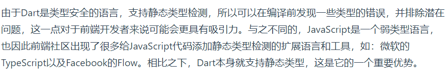
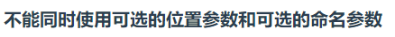
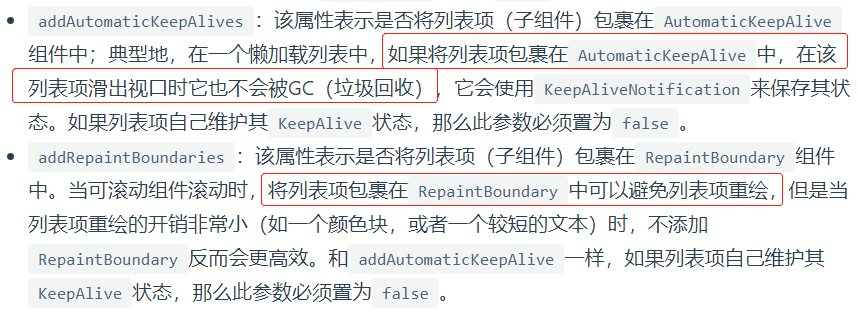
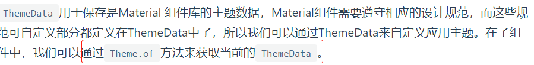

**Flutter实战**

------


### 一、起步

#### 1 跨平台技术比较


#### 2 Flutter采用dart语言的原因





#### 3 flutter框架结构


#### 4 学习资源

- flutter SDK官网：https://api.flutter.dev/index.html
- GitHub：flutter项目的issue
- **StackOverflow**网站
- Gallery源码。在Flutter源码“examples”目录下。
- 第三方库管理文档：https://pub.dev/packages


#### 5 flutter开发环境搭建


不管是window还是mac，最好都配置一下镜像：

```bash
export PUB_HOSTED_URL=https://pub.flutter-io.cn
export FLUTTER_STORAGE_BASE_URL=https://storage.flutter-io.cn
```


##### window平台下

前提条件：需安装git。


- 获取flutter SDK，官网下载：https://flutter.dev/docs/development/tools/sdk/releases
- 解压后，在Flutter安装目录的`flutter`文件下找到`flutter_console.bat`，双击运行
- 转到 “控制面板>用户帐户>用户帐户>环境变量 path”，新增flutter\bin的全路径
- 安装Android Studio。Android Studio可以管理Android 平台依赖、SDK版本。下载地址：https://developer.android.com/studio/index.html
- 运行flutter doctor查看是否还需要安装其它依赖


##### macOS平台

前提条件：


- 获取flutter SDK，官网下载：https://flutter.io/sdk-archive/#macos
- 解压，添加到path中：

```bash
cd ~/development
unzip ~/Downloads/flutter_macos_v0.5.1-beta.zip

vi $HOME/.bash_profile
export PATH=[FLUTTER_INSTALL_PATH]/flutter/bin:$PATH
// 刷新当前终端窗口
source $HOME/.bash_profile  
echo $PATH
```

- 安装Xcode


- 安装Android Studio。Android Studio可以管理Android 平台依赖、SDK版本。下载地址：https://developer.android.com/studio/index.html


##### flutter使用帮助

```bash
// 升级Flutter SDK和依赖包
// 同时更新Flutter SDK和你的flutter项目依赖包
flutter upgrade  

// 如果你只想更新项目依赖包（不包括Flutter SDK
flutter packages get 获取项目所有的依赖包。
flutter packages upgrade 获取项目所有依赖包的最新版本。
```


##### IDE设置

###### vscode配置与使用

- 安装flutter和dart插件
- 安装Code Runner插件
- 安装Awesome Flutter Snippets插件：代码补全
- 安装Flutter Widget Snippets插件：代码补全
- 安装夜神模拟器（用于虚拟机调试）：https://www.bilibili.com/video/BV1S4411E7LY?p=16

可选插件：

- Bracket Pair Colorizer插件：区分括号颜色
- Darcula设置IDE主题

使用方式：

- 创建项目，ctrl+shift+P


- vscode终端输入flutter run，运行项目
- r热重载 R重新编译项目


###### Android Studio 配置与使用

- 安装flutter和dart插件


- 创建flutter应用


- 热重载


###### 真机调试

安卓机调试：


苹果机调试：

[连接iOS真机](https://book.flutterchina.club/chapter1/install_flutter.html#_1-3-3-连接设备运行flutter应用)


###### 常见配置问题


#### 6 dart语言

##### 变量声明

###### var


###### dynamic和Object


即前者有可能会发生运行时错误。


###### final和const


##### 函数


即函数也可以作为方法的参数。在OC中是不可以的，应该使用block。


###### 函数声明


###### 箭头函数


###### 函数作为变量


###### 可选参数


###### 可选的命名参数


###### 注意




##### 异步支持


###### Feature


`Future` 的所有API的返回值仍然是一个`Future`对象，所以可以很**方便的进行链式调用**。

```dart
1. Future.then
/*
使用Future.delayed 创建了一个延时任务，即2秒后返回结果字符串"hi world!"，然后我们在then中接收异步结果并打印结果
*/
Future.delayed(new Duration(seconds: 2),(){
   return "hi world!";
}).then((data){
   print(data);
});


2. Future.catchError
Future.delayed(new Duration(seconds: 2),(){
   //return "hi world!";
   throw AssertionError("Error");  
}).then((data){
   //执行成功会走到这里  
   print("success");
}).catchError((e){
   //执行失败会走到这里  
   print(e);
});


3. Future.whenComplete
Future.delayed(new Duration(seconds: 2),(){
   //return "hi world!";
   throw AssertionError("Error");
}).then((data){
   //执行成功会走到这里 
   print(data);
}).catchError((e){
   //执行失败会走到这里   
   print(e);
}).whenComplete((){
   //无论成功或失败都会走到这里
});


4. Future.wait
/*
有些时候，我们需要等待多个异步任务都执行结束后才进行一些操作，比如我们有一个界面，需要先分别从两个网络接口获取数据，获取成功后，我们需要将两个接口数据进行特定的处理后再显示到UI界面上，应该怎么做？答案是Future.wait，它接受一个Future数组参数，只有数组中所有Future都执行成功后，才会触发then的成功回调，只要有一个Future执行失败，就会触发错误回调。
*/
Future.wait([
  // 2秒后返回结果  
  Future.delayed(new Duration(seconds: 2), () {
    return "hello";
  }),
  // 4秒后返回结果  
  Future.delayed(new Duration(seconds: 4), () {
    return " world";
  })
]).then((results){
  print(results[0]+results[1]);
}).catchError((e){
  print(e);
});
```


###### Async/await

```dart
task() async {
   try{
    String id = await login("alice","******");
    String userInfo = await getUserInfo(id);
    await saveUserInfo(userInfo);
    //执行接下来的操作   
   } catch(e){
    //错误处理   
    print(e);   
   }  
}
```


###### Stream


```dart
Stream.fromFutures([
  // 1秒后返回结果
  Future.delayed(new Duration(seconds: 1), () {
    return "hello 1";
  }),
  // 抛出一个异常
  Future.delayed(new Duration(seconds: 2),(){
    throw AssertionError("Error");
  }),
  // 3秒后返回结果
  Future.delayed(new Duration(seconds: 3), () {
    return "hello 3";
  })
]).listen((data){
   print(data);
}, onError: (e){
   print(e.message);
},onDone: (){

});
```


### 二、第一个flutter应用

#### 1 demo

```dart
import 'package:flutter/material.dart';

void main() => runApp(new MyApp());

class MyApp extends StatelessWidget {
  @override
  Widget build(BuildContext context) {
    return new MaterialApp(
      title: 'Flutter Demo',
      theme: new ThemeData(
        primarySwatch: Colors.blue,
      ),
      home: new MyHomePage(title: 'Flutter Demo Home Page'),
    );
  }
}

class MyHomePage extends StatefulWidget {
  MyHomePage({Key key, this.title}) : super(key: key);
  final String title;

  @override
  _MyHomePageState createState() => new _MyHomePageState();
}

class _MyHomePageState extends State<MyHomePage> {
  int _counter = 0;

  void _incrementCounter() {
    setState(() {
      _counter++;
    });
  }

  @override
  Widget build(BuildContext context) {
    return new Scaffold(
      appBar: new AppBar(
        title: new Text(widget.title),
      ),
      body: new Center(
        // 注意Center只是将子组件对其到屏幕中心，也就是Column
        // 但是Column组件中的子组件需要重新布局
        child: new Column(
          mainAxisAlignment: MainAxisAlignment.center,
          children: <Widget>[
            new Text(
              'You have pushed the button this many times:',
            ),
            new Text(
              '$_counter',
              style: Theme.of(context).textTheme.headline4,
            ),
          ],
        ),
      ),
      floatingActionButton: new FloatingActionButton(
        onPressed: _incrementCounter,
        tooltip: 'Increment',
        child: new Icon(Icons.add),
      ), // This trailing comma makes auto-formatting nicer for build methods.
    );
  }
}
```


##### 调用的流程


对于`StatefulWidget`，将`build`方法放在State中。


#### 2 路由管理


```dart
            FlatButton(
              child: Text("open new route"),
              onPressed: () {
                Navigator.push(context, MaterialPageRoute(builder: (context) {
                  return NewRoute();
                }));
              },
            ),
```

代码分析：

##### MaterialPageRoute


```dart
  MaterialPageRoute({
    WidgetBuilder builder,  // 函数对象？
    RouteSettings settings,
    bool maintainState = true,  
    bool fullscreenDialog = false,
  })
```


##### Navigator


常用方法：


```dart
Navigator.push(BuildContext context, Route route)
// 等价于
Navigator.of(context).push(Route route)
```


##### 路由传值

```dart
// TipRoute.dart
class TipRoute extends StatelessWidget {
  TipRoute({
    Key key,
    @required this.text,  // 可选命名参数，在使用构造函数时，默认指定的参数名就是属性名
  }) : super(key: key);
  final String text;

  @override
  Widget build(BuildContext context) {
    return Scaffold(
      appBar: AppBar(
        title: Text("提示"),
      ),
      body: Padding(
        padding: EdgeInsets.all(18),
        child: Center(
          child: Column(
            children: <Widget>[
              Text(text),
              RaisedButton(
                onPressed: () => Navigator.pop(context, "我是返回值"),
                child: Text("返回"),
              )
            ],
          ),
        ),
      ),
    );
  }
}

// main.dart
import 'TipRoute.dart';
class RouterTestRoute extends StatelessWidget {
  @override
  Widget build(BuildContext context) {
    return Center(
      child: RaisedButton(
        onPressed: () async {
          // 打开`TipRoute`，并等待返回结果
          var result = await Navigator.push(
            context,
            MaterialPageRoute(
              builder: (context) {
                return TipRoute(
                  // 路由参数
                  text: "我是提示xxxx",
                );
              },
            ),
          );
          //输出`TipRoute`路由返回结果
          print("路由返回值: $result");
        },
        child: Text("打开提示页"),
      ),
    );
  }
}
```


##### 命名路由

###### 路由表


###### 注册路由表

```dart
MaterialApp(
  title: 'Flutter Demo',
  theme: ThemeData(
    primarySwatch: Colors.blue,
  ),
  // 注册路由表
  routes:{
   "new_page":(context) => NewRoute(),
    ... // 省略其它路由注册信息
  } ,
  home: MyHomePage(title: 'Flutter Demo Home Page'),
);
```

###### 通过路由名打开新路由页


###### 命名路由参数传递

```dart
// TODO
```

###### 路由生成钩子


```dart
MaterialApp(
  ... //省略无关代码
  onGenerateRoute:(RouteSettings settings){
	  return MaterialPageRoute(builder: (context){
		   String routeName = settings.name;
       // 如果routeName已经注册，可以跳转到对象的页面
       // 如果访问的路由页需要登录，但当前未登录，则直接返回登录页路由，
       // 引导用户登录；其它情况则正常打开路由。
     }
   );
  }
);

// 捕获到Navigator.pushNamed中RouteName，即settings.name
var onGenerateRoute = (RouteSettings settings) {
  final name = settings.name;
  final Function pageContentBuilder = routes[name];

  if (pageContentBuilder != null) {  // 判断路由页面是否已经注册
    if (settings.arguments != null) {
      final Route route = MaterialPageRoute(
        builder: (context) => pageContentBuilder(context, auguments: settings.arguments),
      );
      return route;
    } else {
      final Route route = MaterialPageRoute(
        builder: (context) => pageContentBuilder(context),
      );
      return route;
    }
  }
};
```


#### 3 包管理

flutter中使用配置文件`pubspec.yaml`（位于项目根目录）来管理第三方依赖包。


基本结构：

```yaml
name: flutter_in_action
description: First Flutter application.

version: 1.0.0+1

dependencies:
  flutter:
    sdk: flutter
  cupertino_icons: ^0.1.2

dev_dependencies:
  flutter_test:
    sdk: flutter
    
flutter:
  uses-material-design: true
```


###### 引入第三方库

```yaml
dependencies:
  flutter:
    sdk: flutter

  cupertino_icons: ^0.1.0
  # 新添加的依赖
  english_words: ^3.1.3
```

###### 依赖本地包

```yaml
dependencies:
	pkg1:
        path: ../../code/pkg1
```

###### 依赖git

```yaml
# 如果软件包位于仓库的根目录中
dependencies:
  pkg1:
    git:
      url: git://github.com/xxx/pkg1.git
      
      
# 如果不是，可以使用path参数指定相对位置
dependencies:
  package1:
    git:
      url: git://github.com/flutter/packages.git
      path: packages/package1
```


#### 4 资源管理


详见《[Flutter实战](https://book.flutterchina.club/chapter2/flutter_assets_mgr.html#加载-assets)》。


#### 5 调试flutter应用

###### Dart Observatory


###### print、debugPrint、flutter logs


#### 6 flutter捕获异常

##### Dart单线程模型


##### flutter异常捕获

```dart
void collectLog(String line){
    ... //收集日志
}
void reportErrorAndLog(FlutterErrorDetails details){
    ... //上报错误和日志逻辑
}

FlutterErrorDetails makeDetails(Object obj, StackTrace stack){
    ...// 构建错误信息
}

void main() {
  FlutterError.onError = (FlutterErrorDetails details) {
    reportErrorAndLog(details);
  };
  runZoned(
    () => runApp(MyApp()),
    zoneSpecification: ZoneSpecification(
      print: (Zone self, ZoneDelegate parent, Zone zone, String line) {
        collectLog(line); // 收集日志
      },
    ),
    onError: (Object obj, StackTrace stack) {
      var details = makeDetails(obj, stack);
      reportErrorAndLog(details);
    },
  );
}
```


### 三、基础组件

#### 1 Widget（组件）

##### Widget与Element


##### StatelessWidget


##### StatefulWidget


生命周期：


##### Flutter SDK内置组件库


###### 基础组件


###### Material组件

```dart
import 'package:flutter/material.dart';
```

###### Cupertino组件

```dart
//导入cupertino widget库
import 'package:flutter/cupertino.dart';

class CupertinoTestRoute extends StatelessWidget {
  @override
  Widget build(BuildContext context) {
    return CupertinoPageScaffold(
      navigationBar: CupertinoNavigationBar(
        middle: Text("Cupertino Demo"),
      ),
      child: Center(
        child: CupertinoButton(
            color: CupertinoColors.activeBlue,
            child: Text("Press"),
            onPressed: () {}
        ),
      ),
    );
  }
}
```


#### 2 状态管理

管理原则：


##### Widget管理自身状态

```dart
// TapboxA 管理自身状态.

//------------------------- TapboxA ----------------------------------

class TapboxA extends StatefulWidget {
  TapboxA({Key key}) : super(key: key);

  @override
  _TapboxAState createState() => new _TapboxAState();
}

class _TapboxAState extends State<TapboxA> {
  bool _active = false;

  void _handleTap() {
    setState(() {
      _active = !_active;
    });
  }

  Widget build(BuildContext context) {
    return new GestureDetector(
      onTap: _handleTap,
      child: new Container(
        child: new Center(
          child: new Text(
            _active ? 'Active' : 'Inactive',
            style: new TextStyle(fontSize: 32.0, color: Colors.white),
          ),
        ),
        width: 200.0,
        height: 200.0,
        decoration: new BoxDecoration(
          color: _active ? Colors.lightGreen[700] : Colors.grey[600],
        ),
      ),
    );
  }
}
```


##### 父Widget管理子Widget的状态

案例：


```dart
// ParentWidget 为 TapboxB 管理状态.

//------------------------ ParentWidget --------------------------------

class ParentWidget extends StatefulWidget {
  @override
  _ParentWidgetState createState() => new _ParentWidgetState();
}

class _ParentWidgetState extends State<ParentWidget> {
  bool _active = false;

  void _handleTapboxChanged(bool newValue) {
    setState(() {  // 一旦被调用就会重新执行build方法
      _active = newValue;
    });
  }

  @override
  Widget build(BuildContext context) {
    return new Container(
      child: new TapboxB(
        active: _active,
        onChanged: _handleTapboxChanged,
      ),
    );
  }
}

//------------------------- TapboxB ----------------------------------

class TapboxB extends StatelessWidget {
  TapboxB({Key key, this.active: false, @required this.onChanged})
      : super(key: key);

  final bool active;
  final ValueChanged<bool> onChanged;

  void _handleTap() {
    onChanged(!active);  // 调用父widget中的方法
  }

  Widget build(BuildContext context) {
    return new GestureDetector(
      onTap: _handleTap,  // 绑定方法
      child: new Container(
        child: new Center(
          child: new Text(
            active ? 'Active' : 'Inactive',
            style: new TextStyle(fontSize: 32.0, color: Colors.white),
          ),
        ),
        width: 200.0,
        height: 200.0,
        decoration: new BoxDecoration(
          color: active ? Colors.lightGreen[700] : Colors.grey[600],
        ),
      ),
    );
  }
}
```


##### 混合状态管理

```dart
//---------------------------- ParentWidget ----------------------------

class ParentWidgetC extends StatefulWidget {
  @override
  _ParentWidgetCState createState() => new _ParentWidgetCState();
}

class _ParentWidgetCState extends State<ParentWidgetC> {
  bool _active = false;

  void _handleTapboxChanged(bool newValue) {
    setState(() {
      _active = newValue;
    });
  }

  @override
  Widget build(BuildContext context) {
    return new Container(
      child: new TapboxC(
        active: _active,
        onChanged: _handleTapboxChanged,
      ),
    );
  }
}

//----------------------------- TapboxC ------------------------------

class TapboxC extends StatefulWidget {
  TapboxC({Key key, this.active: false, @required this.onChanged})
      : super(key: key);

  final bool active;
  final ValueChanged<bool> onChanged;
  
  @override
  _TapboxCState createState() => new _TapboxCState();
}

class _TapboxCState extends State<TapboxC> {
  bool _highlight = false;

  void _handleTapDown(TapDownDetails details) {
    setState(() {
      _highlight = true;
    });
  }

  void _handleTapUp(TapUpDetails details) {
    setState(() {
      _highlight = false;
    });
  }

  void _handleTapCancel() {
    setState(() {
      _highlight = false;
    });
  }

  void _handleTap() {
    widget.onChanged(!widget.active);
  }

  @override
  Widget build(BuildContext context) {
    // 在按下时添加绿色边框，当抬起时，取消高亮  
    return new GestureDetector(
      onTapDown: _handleTapDown, // 处理按下事件
      onTapUp: _handleTapUp, // 处理抬起事件
      onTap: _handleTap,
      onTapCancel: _handleTapCancel,
      child: new Container(
        child: new Center(
          child: new Text(widget.active ? 'Active' : 'Inactive',
              style: new TextStyle(fontSize: 32.0, color: Colors.white)),
        ),
        width: 200.0,
        height: 200.0,
        decoration: new BoxDecoration(
          color: widget.active ? Colors.lightGreen[700] : Colors.grey[600],
          border: _highlight
              ? new Border.all(
                  color: Colors.teal[700],
                  width: 10.0,
                )
              : null,
        ),
      ),
    );
  }
}
```


#### 3 文本及样式

##### TextStyle

```dart
Text("Hello world",
  style: TextStyle(
    color: Colors.blue,
    fontSize: 18.0,
    height: 1.2,  
    fontFamily: "Courier",
    background: new Paint()..color=Colors.yellow,
    decoration:TextDecoration.underline,
    decorationStyle: TextDecorationStyle.dashed
  ),
);
```


##### TextSpan

```dart
Text.rich(TextSpan(
    children: [
     TextSpan(
       text: "Home: "
     ),
     TextSpan(
       text: "https://flutterchina.club",
       style: TextStyle(
         color: Colors.blue
       ),  
       recognizer: _tapRecognizer
     ),
    ]
))
```


##### DefaultTextStyle

```dart
DefaultTextStyle(
  //1.设置文本默认样式  
  style: TextStyle(
    color:Colors.red,
    fontSize: 20.0,
  ),
  textAlign: TextAlign.start,
  child: Column(
    crossAxisAlignment: CrossAxisAlignment.start,
    children: <Widget>[
      Text("hello world"),
      Text("I am Jack"),
      Text("I am Jack",
        style: TextStyle(
          inherit: false, //2.不继承默认样式
          color: Colors.grey
        ),
      ),
    ],
  ),
);
```


##### 字体


#### 4 按钮

##### RaisedButton


##### FlatButton


##### OutlineButton


##### IconButton


```dart
IconButton(
  icon: Icon(Icons.thumb_up),
  onPressed: () {},
)
```


##### 带图标的按钮


```dart
RaisedButton.icon(
  icon: Icon(Icons.send),
  label: Text("发送"),
  onPressed: _onPressed,
),
OutlineButton.icon(
  icon: Icon(Icons.add),
  label: Text("添加"),
  onPressed: _onPressed,
),
FlatButton.icon(
  icon: Icon(Icons.info),
  label: Text("详情"),
  onPressed: _onPressed,
),
```


##### 案例：圆角按钮

```dart
            RaisedButton(
              color: Colors.blue,
              highlightColor: Colors.blue[700],
              colorBrightness: Brightness.dark,
              splashColor: Colors.grey,
              child: Text("Submit"),
              // 设置形状
              shape: RoundedRectangleBorder(borderRadius: BorderRadius.circular(20.0)),
              onPressed: () {},
            )
```


#### 5 图片以及icon

##### Image组件

###### 从asset中加载图片

- 工程根目录下创建`images`目录
- 在`pubspec.yaml`中的`flutter`部分添加如下内容:

```yaml
  assets:
    - images/avatar.png
```

- 使用：

```dart
Image(
  image: AssetImage("images/avatar.png"),
  width: 100.0
);
// 或者
Image.asset("images/avatar.png",
  width: 100.0,
)
```


###### 从网络加载图片

```dart
Image(
  image: NetworkImage(
      "https://avatars2.githubusercontent.com/u/20411648?s=460&v=4"),
  width: 100.0,
)
    
Image.network(
  "https://avatars2.githubusercontent.com/u/20411648?s=460&v=4",
  width: 100.0,
)
```


###### 参数说明

```dart
const Image({
  ...
  this.width, //图片的宽
  this.height, //图片高度
  this.color, //图片的混合色值
  this.colorBlendMode, //混合模式
  this.fit,//缩放模式
  this.alignment = Alignment.center, //对齐方式
  this.repeat = ImageRepeat.noRepeat, //重复方式
  ...
})
```


##### Icon组件


#### 6 单选开关和复选框

##### Switch和Checkbox


```dart
class SwitchAndCheckBoxTestRoute extends StatefulWidget {
  @override
  _SwitchAndCheckBoxTestRouteState createState() => new _SwitchAndCheckBoxTestRouteState();
}

class _SwitchAndCheckBoxTestRouteState extends State<SwitchAndCheckBoxTestRoute> {
  bool _switchSelected=true; //维护单选开关状态
  bool _checkboxSelected=true;//维护复选框状态
  @override
  Widget build(BuildContext context) {
    return Column(
      children: <Widget>[
        Switch(
          value: _switchSelected,//当前状态
          onChanged:(value){
            //重新构建页面  
            setState(() {
              _switchSelected=value;
            });
          },
        ),
        Checkbox(
          value: _checkboxSelected,
          activeColor: Colors.red, //选中时的颜色
          onChanged:(value){
            setState(() {
              _checkboxSelected=value;
            });
          } ,
        )
      ],
    );
  }
}
```


#### 7 输入框和表单

##### TextField 文本框

关键属性：

```dart
const TextField({
  ...
  TextEditingController controller, 
  FocusNode focusNode,
  InputDecoration decoration = const InputDecoration(),
  TextInputType keyboardType,
  TextInputAction textInputAction,
  TextStyle style,
  TextAlign textAlign = TextAlign.start,
  bool autofocus = false,
  bool obscureText = false,
  int maxLines = 1,
  int maxLength,
  bool maxLengthEnforced = true,
  ValueChanged<String> onChanged,
  VoidCallback onEditingComplete,
  ValueChanged<String> onSubmitted,
  List<TextInputFormatter> inputFormatters,
  bool enabled,
  this.cursorWidth = 2.0,
  this.cursorRadius,
  this.cursorColor,
  ...
})
```

布局：

```dart
Column(
        children: <Widget>[
          TextField(
            autofocus: true,
            decoration: InputDecoration(
                labelText: "用户名",
                hintText: "用户名或邮箱",
                prefixIcon: Icon(Icons.person)
            ),
          ),
          TextField(
            decoration: InputDecoration(
                labelText: "密码",
                hintText: "您的登录密码",
                prefixIcon: Icon(Icons.lock)
            ),
            obscureText: true,
          ),
        ],
);
```

获取输入内容：


```dart
//定义一个controller
TextEditingController _unameController = TextEditingController();

TextField(
    autofocus: true,
    controller: _unameController, //设置controller
    ...
)
    
// 监听文本变化
@override
void initState() {
  //监听输入改变  
  _unameController.addListener((){
    print(_unameController.text);
  });
}
```


##### 表单

###### Form


###### TextFormFiled


###### FormState


```dart
class FormTestRoute extends StatefulWidget {
  @override
  _FormTestRouteState createState() => new _FormTestRouteState();
}

class _FormTestRouteState extends State<FormTestRoute> {
  TextEditingController _unameController = new TextEditingController();
  TextEditingController _pwdController = new TextEditingController();
  GlobalKey _formKey= new GlobalKey<FormState>();

  @override
  Widget build(BuildContext context) {
    return Scaffold(
      appBar: AppBar(
        title:Text("Form Test"),
      ),
      body: Padding(
        padding: const EdgeInsets.symmetric(vertical: 16.0, horizontal: 24.0),
        child: Form(
          key: _formKey, //设置globalKey，用于后面获取FormState
          autovalidate: true, //开启自动校验
          child: Column(
            children: <Widget>[
              TextFormField(
                  autofocus: true,
                  controller: _unameController,
                  decoration: InputDecoration(
                      labelText: "用户名",
                      hintText: "用户名或邮箱",
                      icon: Icon(Icons.person)
                  ),
                  // 校验用户名
                  validator: (v) {
                    return v
                        .trim()
                        .length > 0 ? null : "用户名不能为空";
                  }

              ),
              TextFormField(
                  controller: _pwdController,
                  decoration: InputDecoration(
                      labelText: "密码",
                      hintText: "您的登录密码",
                      icon: Icon(Icons.lock)
                  ),
                  obscureText: true,
                  //校验密码
                  validator: (v) {
                    return v
                        .trim()
                        .length > 5 ? null : "密码不能少于6位";
                  }
              ),
              // 登录按钮
              Padding(
                padding: const EdgeInsets.only(top: 28.0),
                child: Row(
                  children: <Widget>[
                    Expanded(
                      child: RaisedButton(
                        padding: EdgeInsets.all(15.0),
                        child: Text("登录"),
                        color: Theme
                            .of(context)
                            .primaryColor,
                        textColor: Colors.white,
                        onPressed: () {                            
                          // 通过_formKey.currentState 获取FormState后，
                          // 调用validate()方法校验用户名密码是否合法，校验
                          // 通过后再提交数据。 
                          if((_formKey.currentState as FormState).validate()){
                            //验证通过提交数据
                          }
                        },
                      ),
                    ),
                  ],
                ),
              )
            ],
          ),
        ),
      ),
    );
  }
}
```


#### 8 进度指示器


##### LinearProgressIndicator


##### CircularProgressIndicator


##### 自定义尺寸

```dart
// 线性进度条高度指定为3
SizedBox(
  height: 3,
  child: LinearProgressIndicator(
    backgroundColor: Colors.grey[200],
    valueColor: AlwaysStoppedAnimation(Colors.blue),
    value: .5,
  ),
),
// 圆形进度条直径指定为100
SizedBox(
  height: 100,
  width: 100,
  child: CircularProgressIndicator(
    backgroundColor: Colors.grey[200],
    valueColor: AlwaysStoppedAnimation(Colors.blue),
    value: .7,
  ),
),
```


##### 案例

实现一个进度条在3秒内从灰色变成蓝色的动画：

```dart
import 'package:flutter/material.dart';

class ProgressRoute extends StatefulWidget {
  @override
  _ProgressRouteState createState() => _ProgressRouteState();
}

class _ProgressRouteState extends State<ProgressRoute> with SingleTickerProviderStateMixin {
  AnimationController _animationController;

  @override
  void initState() {
    //动画执行时间3秒  
    _animationController =
        new AnimationController(vsync: this, duration: Duration(seconds: 3));
    _animationController.forward();
    _animationController.addListener(() => setState(() => {}));
    super.initState();
  }

  @override
  void dispose() {
    _animationController.dispose();
    super.dispose();
  }

  @override
  Widget build(BuildContext context) {
    return SingleChildScrollView(
      child: Column(
        children: <Widget>[
            Padding(
            padding: EdgeInsets.all(16),
            child: LinearProgressIndicator(
              backgroundColor: Colors.grey[200],
              valueColor: ColorTween(begin: Colors.grey, end: Colors.blue)
                .animate(_animationController), // 从灰色变成蓝色
              value: _animationController.value,
            ),
          );
        ],
      ),
    );
  }
}
```


### 四、布局类组件

#### 1 线性布局


##### Row

```dart
// 
Row({
  ...  
  // 表示水平方向子组件的布局顺序(是从左往右还是从右往左)
  TextDirection textDirection,    
  // 表示尽可能多的占用水平方向的空间，此时无论子widgets实际占用多少水平空间，Row的宽度始终等于水平方向的最大宽度
  MainAxisSize mainAxisSize = MainAxisSize.max,   
  MainAxisAlignment mainAxisAlignment = MainAxisAlignment.start,
    
  VerticalDirection verticalDirection = VerticalDirection.down,  
  CrossAxisAlignment crossAxisAlignment = CrossAxisAlignment.center,
  List<Widget> children = const <Widget>[],
})
```


##### Column

```dart
import 'package:flutter/material.dart';

class CenterColumnRoute extends StatelessWidget {
  @override
  Widget build(BuildContext context) {
    return Column(
      crossAxisAlignment: CrossAxisAlignment.center,
      children: <Widget>[
        Text("hi"),
        Text("world"),
      ],
    );
  }
}
```


##### 特殊情况


#### 2 弹性布局（Flex）

Flutter中的弹性布局主要通过`Flex`和`Expanded`来配合实现。

##### Flex


##### Expanded

和Flex组件配合使用，一般放在Flex组件中。

```dart
const Expanded({
  int flex = 1, 
  @required Widget child,
})
```


```dart
class FlexLayoutTestRoute extends StatelessWidget {
  @override
  Widget build(BuildContext context) {
    return Column(
      children: <Widget>[  // children中每一个组件独占一行 比如Flex和Padding
        //Flex的两个子widget按1：2来占据水平空间  
        Flex(
          direction: Axis.horizontal,
          children: <Widget>[
            Expanded(
              flex: 1,
              child: Container(
                height: 30.0,
                color: Colors.red,
              ),
            ),
            Expanded(
              flex: 2,
              child: Container(
                height: 30.0,
                color: Colors.green,
              ),
            ),
          ],
        ),
        
        Padding(
          padding: const EdgeInsets.only(top: 20.0),
          child: SizedBox(
            height: 100.0,
            //Flex的三个子widget，在垂直方向按2：1：1来占用100像素的空间  
            child: Flex(
              direction: Axis.vertical,
              children: <Widget>[
                Expanded(
                  flex: 2,
                  child: Container(
                    height: 30.0,
                    color: Colors.red,
                  ),
                ),
                Spacer(
                  flex: 1,
                ),
                Expanded(
                  flex: 1,
                  child: Container(
                    height: 30.0,
                    color: Colors.green,
                  ),
                ),
              ],
            ),
          ),
        ),
      ],
    );
  }
}
```


#### 3 流式布局

我们把超出屏幕显示范围**会自动折行的布局**称为流式布局。

##### Wrap

```dart
Wrap({
  ...
  this.direction = Axis.horizontal,
  this.alignment = WrapAlignment.start,
  this.spacing = 0.0,  // 主轴方向子widget的间距
  this.runAlignment = WrapAlignment.start,  // 纵轴方向的对齐方式
  this.runSpacing = 0.0,  // 纵轴方向的间距
  this.crossAxisAlignment = WrapCrossAlignment.start,
  this.textDirection,
  this.verticalDirection = VerticalDirection.down,
  List<Widget> children = const <Widget>[],
})
```

```dart
Wrap(
  spacing: 8.0, // 主轴(水平)方向间距
  runSpacing: 4.0, // 纵轴（垂直）方向间距
  alignment: WrapAlignment.center, //沿主轴方向居中
  children: <Widget>[
    new Chip(
      avatar: new CircleAvatar(backgroundColor: Colors.blue, child: Text('A')),
      label: new Text('Hamilton'),
    ),
    new Chip(
      avatar: new CircleAvatar(backgroundColor: Colors.blue, child: Text('M')),
      label: new Text('Lafayette'),
    ),
    new Chip(
      avatar: new CircleAvatar(backgroundColor: Colors.blue, child: Text('H')),
      label: new Text('Mulligan'),
    ),
    new Chip(
      avatar: new CircleAvatar(backgroundColor: Colors.blue, child: Text('J')),
      label: new Text('Laurens'),
    ),
  ],
)
```


##### Flow

`Flow`主要用于一些需要**自定义布局策略**或性能要求较高(如动画中)的场景。`Flow`有如下优点：


```dart
Flow(
  delegate: TestFlowDelegate(margin: EdgeInsets.all(10.0)),
  children: <Widget>[
    new Container(width: 80.0, height:80.0, color: Colors.red,),
    new Container(width: 80.0, height:80.0, color: Colors.green,),
    new Container(width: 80.0, height:80.0, color: Colors.blue,),
    new Container(width: 80.0, height:80.0,  color: Colors.yellow,),
    new Container(width: 80.0, height:80.0, color: Colors.brown,),
    new Container(width: 80.0, height:80.0,  color: Colors.purple,),
  ],
)
    
class TestFlowDelegate extends FlowDelegate {
  EdgeInsets margin = EdgeInsets.zero;
  TestFlowDelegate({this.margin});
  @override
  void paintChildren(FlowPaintingContext context) {
    var x = margin.left;
    var y = margin.top;
    //计算每一个子widget的位置  
    for (int i = 0; i < context.childCount; i++) {
      var w = context.getChildSize(i).width + x + margin.right;
      if (w < context.size.width) {
        context.paintChild(i,
            transform: new Matrix4.translationValues(
                x, y, 0.0));
        x = w + margin.left;
      } else {
        x = margin.left;
        y += context.getChildSize(i).height + margin.top + margin.bottom;
        //绘制子widget(有优化)  
        context.paintChild(i,
            transform: new Matrix4.translationValues(
                x, y, 0.0));
         x += context.getChildSize(i).width + margin.left + margin.right;
      }
    }
  }

  @override
  getSize(BoxConstraints constraints){
    //指定Flow的大小  
    return Size(double.infinity,200.0);
  }

  @override
  bool shouldRepaint(FlowDelegate oldDelegate) {
    return oldDelegate != this;
  }
}
```


#### 4 层叠布局


##### Stack

```dart
Stack({
  this.alignment = AlignmentDirectional.topStart,
  this.textDirection,
  this.fit = StackFit.loose,
  this.overflow = Overflow.clip,
  List<Widget> children = const <Widget>[],
})
```


##### Positioned（绝对定位）

```dart
const Positioned({
  Key key,
  this.left, 
  this.top,
  this.right,
  this.bottom,
  this.width,
  this.height,
  @required Widget child,
})
```


##### 案例

Stack容器中的组件都是按堆叠的方式展示的。

```dart
Stack(
  alignment:Alignment.center ,
  fit: StackFit.expand, //未定位widget占满Stack整个空间
  children: <Widget>[
    Positioned(
      left: 18.0,
      child: Text("I am Jack"),
    ),
    // 未定位，将占满Stack整个空间，因此将第一个组件覆盖
    Container(child: Text("Hello world",style: TextStyle(color: Colors.white)),
      color: Colors.red,
    ),
    Positioned(
      top: 18.0,
      child: Text("Your friend"),
    )
  ],
),
```


#### 5 对齐与相对定位

##### Align

```dart
Align({
  Key key,
  // 表示子组件在父组件中的起始位置
  this.alignment = Alignment.center,  
  // 两个缩放因子，会分别乘以子元素的宽、高，最终的结果就是Align 组件的宽高
  this.widthFactor,
  this.heightFactor,
    
  Widget child,
})
```


##### Alignment


##### FractionalOffset


### 五、容器类组件

#### 1 填充Padding

```dart
Padding({
  ...
  EdgeInsetsGeometry padding,
  Widget child,
})
```

##### EdgeInsets


#### 2 尺寸限制类


##### ConstrainedBox

```dart
ConstrainedBox(
  constraints: BoxConstraints(  // 配合使用的组件
    minWidth: double.infinity, //宽度尽可能大
    minHeight: 50.0 //最小高度为50像素
  ),
  child: Container(
      height: 5.0, 
      child: redBox 
  ),
)
```


##### SizedBox

```dart
SizedBox(
  width: 80.0,
  height: 80.0,
  child: redBox
)
```


##### 多重限制

```dart
ConstrainedBox(
    constraints: BoxConstraints(minWidth: 90.0, minHeight: 20.0),
    child: ConstrainedBox(
      constraints: BoxConstraints(minWidth: 60.0, minHeight: 60.0),
      child: redBox,
    )
)
```


##### UnconstrainedBox

```dart
ConstrainedBox(
    constraints: BoxConstraints(minWidth: 60.0, minHeight: 100.0),  //父
    child: UnconstrainedBox( //“去除”父级限制
      child: ConstrainedBox(
        constraints: BoxConstraints(minWidth: 90.0, minHeight: 20.0),//子
        child: redBox,
      ),
    )
)
```


##### AspectRatio


#### 3 装饰容器DecoratedBox

```dart
const DecoratedBox({
  Decoration decoration,  // 通常使用BoxDecoration
  DecorationPosition position = DecorationPosition.background,
  Widget child
})

BoxDecoration({
  Color color, //颜色
  DecorationImage image,//图片
  BoxBorder border, //边框
  BorderRadiusGeometry borderRadius, //圆角
  List<BoxShadow> boxShadow, //阴影,可以指定多个
  Gradient gradient, //渐变
  BlendMode backgroundBlendMode, //背景混合模式
  BoxShape shape = BoxShape.rectangle, //形状
})
```


##### 案例

```dart
 DecoratedBox(
    decoration: BoxDecoration(
      gradient: LinearGradient(colors:[Colors.red,Colors.orange[700]]), //背景渐变
      borderRadius: BorderRadius.circular(3.0), //3像素圆角
      boxShadow: [ //阴影
        BoxShadow(
            color:Colors.black54,
            offset: Offset(2.0,2.0),  // 阴影的偏移
            blurRadius: 4.0
        )
      ]
    ),
  child: Padding(padding: EdgeInsets.symmetric(horizontal: 80.0, vertical: 18.0),
    child: Text("Login", style: TextStyle(color: Colors.white),),
  )
)
```


#### 4 变换 Transform


也就是Transform的效果在绘制时才显现，而布局是事先确定好的。


##### RotatedBox


#### 5 Container

```dart
Container({
  this.alignment,
  this.padding, //容器内补白，属于decoration的装饰范围
  Color color, // 背景色
  Decoration decoration, // 背景装饰
  Decoration foregroundDecoration, //前景装饰
  double width,//容器的宽度
  double height, //容器的高度
  BoxConstraints constraints, //容器大小的限制条件
  this.margin,//容器外补白，不属于decoration的装饰范围
  this.transform, //变换
  this.child,
})
```

```dart
Container(
  margin: EdgeInsets.only(top: 50.0, left: 120.0), //容器外填充
  constraints: BoxConstraints.tightFor(width: 200.0, height: 150.0), //卡片大小
  decoration: BoxDecoration(//背景装饰
      gradient: RadialGradient( //背景径向渐变
          colors: [Colors.red, Colors.orange],
          center: Alignment.topLeft,
          radius: .98
      ),
      boxShadow: [ //卡片阴影
        BoxShadow(
            color: Colors.black54,
            offset: Offset(2.0, 2.0),
            blurRadius: 4.0
        )
      ]
  ),
  transform: Matrix4.rotationZ(.2), //卡片倾斜变换
  alignment: Alignment.center, //卡片内文字居中
  child: Text( //卡片文字
    "5.20", style: TextStyle(color: Colors.white, fontSize: 40.0),
  ),
);
```


##### padding和margin


#### 6 Scaffold、TabBar、底部导航

```dart
import 'package:flutter/material.dart';
import 'MyDrawer.dart';

main() => runApp(MyApp());

class MyApp extends StatelessWidget {
  // This widget is the root of your application.
  @override
  Widget build(BuildContext context) {
    return MaterialApp(
      debugShowCheckedModeBanner: false,
      title: 'Flutter Demo',
      theme: ThemeData(
        primarySwatch: Colors.blue,
      ),
      routes: {
        '/': (context) => ScaffoldRoute(),
      },
      initialRoute: '/',
    );
  }
}

class ScaffoldRoute extends StatefulWidget {
  @override
  _ScaffoldRouteState createState() => new _ScaffoldRouteState();
}

class _ScaffoldRouteState extends State<ScaffoldRoute> with SingleTickerProviderStateMixin {
  int _selectedIndex = 1;
  TabController _tabController;
  List tabs = ["新闻", "历史", "图片"];
  void _onAdd() {}
  void _onItemTapped(int index) {
    setState(() {
      _selectedIndex = index;
    });
  }

  @override
  void initState() {
    super.initState();
    // 创建Controller
    _tabController = TabController(length: tabs.length, vsync: this);
  }

  @override
  Widget build(BuildContext context) {
    return Scaffold(
      appBar: AppBar(
        title: Text("App Name"),
        // Builder用来构建一个组件？
        leading: Builder(builder: (context) {
          return IconButton(
            icon: Icon(Icons.dashboard, color: Colors.white), //自定义图标
            onPressed: () {
              // 打开抽屉菜单
              Scaffold.of(context).openDrawer();
            },
          );
        }),
        actions: [
          IconButton(
            icon: Icon(Icons.share),
            onPressed: () {
              print("share");
            },
          )
        ],
        bottom: TabBar(
            controller: _tabController,
            tabs: tabs
                .map((e) => Tab(
                      text: e,
                    ))
                .toList()),
      ),
      drawer: MyDrawer(),
      floatingActionButton: FloatingActionButton(
        child: Icon(Icons.add),
        onPressed: _onAdd,
      ),
      floatingActionButtonLocation: FloatingActionButtonLocation.centerDocked,
      // bottomNavigationBar: BottomNavigationBar(
      //   items: [
      //     BottomNavigationBarItem(icon: Icon(Icons.home), label: "Home"),
      //     BottomNavigationBarItem(icon: Icon(Icons.business), label: "Business"),
      //     BottomNavigationBarItem(icon: Icon(Icons.school), label: "School"),
      //   ],
      //   currentIndex: _selectedIndex,
      //   fixedColor: Colors.blue,
      //   onTap: _onItemTapped,
      // ),
      bottomNavigationBar: BottomAppBar(
        color: Colors.white,
        shape: CircularNotchedRectangle(), // 底部导航栏打一个圆形的洞
        child: Row(
          children: [
            IconButton(icon: Icon(Icons.home), onPressed: () => print("Home")),
            SizedBox(), //中间位置空出
            IconButton(icon: Icon(Icons.business), onPressed: () => print("School")),
          ],
          mainAxisAlignment: MainAxisAlignment.spaceAround, //均分底部导航栏横向空间
        ),
      ),
      body: TabBarView(
        // TabBar和TabBarView正是通过同一个controller来实现菜单切换和滑动状态同步的
        controller: _tabController,
        children: tabs.map((e) {
          return Container(
            alignment: Alignment.center,
            child: Text(
              e,
              textScaleFactor: 5,
            ),
          );
        }).toList(),
      ),
    );
  }
}

```


#### 7 Clip


##### CustomClipper

```dart
class MyClipper extends CustomClipper<Rect> {
  @override
  Rect getClip(Size size) => Rect.fromLTWH(10.0, 15.0, 40.0, 30.0);

  @override
  bool shouldReclip(CustomClipper<Rect> oldClipper) => false;
}

DecoratedBox(
  decoration: BoxDecoration(
    color: Colors.red
  ),
  child: ClipRect(
      clipper: MyClipper(), //使用自定义的clipper
      child: avatar  // 大小是60x60
  ),
)
```


先布局阶段->后绘制阶段。也就是该组件是在绘制阶段才生效的，但是布局已经固定了。


### 六、可滚动组件


#### 1 SingleChildScrollView

不支持基于Sliver的延迟构建模型。


```dart
class SingleChildScrollViewTestRoute extends StatelessWidget {
  @override
  Widget build(BuildContext context) {
    String str = "ABCDEFGHIJKLMNOPQRSTUVWXYZ";
    return Scrollbar( // 显示进度条
      child: SingleChildScrollView(
        padding: EdgeInsets.all(16.0),
        child: Center(
          child: Column( 
            //动态创建一个List<Widget>  
            children: str.split("") 
                //每一个字母都用一个Text显示,字体为原来的两倍
                .map((c) => Text(c, textScaleFactor: 2.0,)) 
                .toList(),
          ),
        ),
      ),
    );
  }
}
```


#### 2 ListView

```dart
ListView({
  ...  
  //可滚动widget公共参数
  Axis scrollDirection = Axis.vertical,
  bool reverse = false,
  ScrollController controller,
  bool primary,
  ScrollPhysics physics,
  EdgeInsetsGeometry padding,
  
  //ListView各个构造函数的共同参数  
  double itemExtent,  // 该参数如果不为null，则会强制children的“长度”为itemExtent的值
  bool shrinkWrap = false,
  bool addAutomaticKeepAlives = true,
  bool addRepaintBoundaries = true,
  double cacheExtent,
    
  //子widget列表
  List<Widget> children = const <Widget>[],
})
```



##### 默认构造函数


##### ListView.builder

命名构造函数。只有**当子组件真正显示的时候才会被创建**，也就说通过该构造函数创建的`ListView`是支持基于Sliver的懒加载模型的。

```dart
ListView.builder({
  // ListView公共参数已省略  
  ...
  @required IndexedWidgetBuilder itemBuilder,
  int itemCount,
  ...
})
```


实例：

```dart
ListView.builder(
    itemCount: 100,
    itemExtent: 50.0, //强制高度为50.0
    itemBuilder: (BuildContext context, int index) {
      return ListTile(title: Text("$index"));
    }
);
```


##### ListView.separated

多了一个构造器。

```dart
class ListView3 extends StatelessWidget {
  @override
  Widget build(BuildContext context) {
    //下划线widget预定义以供复用。  
    Widget divider1=Divider(color: Colors.blue,);
    Widget divider2=Divider(color: Colors.green);
    return ListView.separated(
        itemCount: 100,
        //列表项构造器
        // 捕获一个下标参数index
        itemBuilder: (BuildContext context, int index) {
          return ListTile(title: Text("$index"));
        },
        //分割器构造器
        separatorBuilder: (BuildContext context, int index) {
          return index%2==0?divider1:divider2;
        },
    );
  }
}
```


##### 无限列表

```dart
class InfiniteListView extends StatefulWidget {
  @override
  _InfiniteListViewState createState() => new _InfiniteListViewState();
}

class _InfiniteListViewState extends State<InfiniteListView> {
  static const loadingTag = "##loading##"; //表尾标记
  var _words = <String>[loadingTag];

  @override
  void initState() {
    super.initState();
    _retrieveData();
  }

  @override
  Widget build(BuildContext context) {
    return ListView.separated(
      itemCount: _words.length,
      itemBuilder: (context, index) {
        //如果到了表尾
        if (_words[index] == loadingTag) {
          //不足100条，继续获取数据
          if (_words.length - 1 < 100) {
            //获取数据
            _retrieveData();
            //加载时显示loading
            return Container(
              padding: const EdgeInsets.all(16.0),
              alignment: Alignment.center,
              child: SizedBox(
                  width: 24.0,
                  height: 24.0,
                  child: CircularProgressIndicator(strokeWidth: 2.0)
              ),
            );
          } else {
            //已经加载了100条数据，不再获取数据。
            return Container(
                alignment: Alignment.center,
                padding: EdgeInsets.all(16.0),
                child: Text("没有更多了", style: TextStyle(color: Colors.grey),)
            );
          }
        }
        //显示单词列表项
        return ListTile(title: Text(_words[index]));
      },
      separatorBuilder: (context, index) => Divider(height: .0),
    );
  }

  void _retrieveData() {
    //  等待两秒让加载时显示loading的组件得以展示
    Future.delayed(Duration(seconds: 2)).then((e) {
      setState(() {
        //重新构建列表
		_words.insertAll(_words.length - 1,
          //每次生成20个单词
          generateWordPairs().take(20).map((e) => e.asPascalCase).toList()
      	);
      });
    });
  }

}
```


##### 固定表头的列表

```dart
@override
Widget build(BuildContext context) {
  return Column(children: <Widget>[
    ListTile(title:Text("商品列表")),
    Expanded(
      child: ListView.builder(
          // 没有itemCount表示无限列表
          itemBuilder: (BuildContext context, int index) {
        	return ListTile(title: Text("$index"));
      }),
    ),
  ]);
}
```


#### 3 GridView

`GridView`可以构建一个二维网格列表，其默认构造函数定义如下：

```dart
GridView({
  Axis scrollDirection = Axis.vertical,
  bool reverse = false,
  ScrollController controller,
  bool primary,
  ScrollPhysics physics,
  bool shrinkWrap = false,
  EdgeInsetsGeometry padding,
    
  @required SliverGridDelegate gridDelegate, //控制子widget layout的委托
  bool addAutomaticKeepAlives = true,
  bool addRepaintBoundaries = true,
  double cacheExtent,
  List<Widget> children = const <Widget>[],
})
```


##### SliverGridDelegateWithFixedCrossAxisCount

```dart
SliverGridDelegateWithFixedCrossAxisCount({
  @required double crossAxisCount,   // 横轴上子元素的个数
  double mainAxisSpacing = 0.0,  // 主轴方向的间距
  double crossAxisSpacing = 0.0,  // 横轴方向子元素的间距
  double childAspectRatio = 1.0,  // 子元素在横轴长度和主轴长度的比例
})
```

```dart
GridView(
  gridDelegate: SliverGridDelegateWithFixedCrossAxisCount(
      crossAxisCount: 3, //横轴三个子widget
      childAspectRatio: 1.0 //宽高比为1时，子widget
  ),
  children:<Widget>[
    Icon(Icons.ac_unit),
    Icon(Icons.airport_shuttle),
    Icon(Icons.all_inclusive),
    Icon(Icons.beach_access),
    Icon(Icons.cake),
    Icon(Icons.free_breakfast)
  ]
);
// 等价于
GridView.count( 
  crossAxisCount: 3,
  childAspectRatio: 1.0,
  children: <Widget>[
    Icon(Icons.ac_unit),
    Icon(Icons.airport_shuttle),
    Icon(Icons.all_inclusive),
    Icon(Icons.beach_access),
    Icon(Icons.cake),
    Icon(Icons.free_breakfast),
  ],
);
```


##### SliverGridDelegateWithMaxCrossAxisExtent

```dart
SliverGridDelegateWithMaxCrossAxisExtent({
  double maxCrossAxisExtent,  // 子元素在横轴上的最大长度
  double mainAxisSpacing = 0.0,
  double crossAxisSpacing = 0.0,
  double childAspectRatio = 1.0,
})
```

```dart
GridView(
  padding: EdgeInsets.zero,
  gridDelegate: SliverGridDelegateWithMaxCrossAxisExtent(
      maxCrossAxisExtent: 120.0,
      childAspectRatio: 2.0 //宽高比为2
  ),
  children: <Widget>[
    Icon(Icons.ac_unit),
    Icon(Icons.airport_shuttle),
    Icon(Icons.all_inclusive),
    Icon(Icons.beach_access),
    Icon(Icons.cake),
    Icon(Icons.free_breakfast),
  ],
);
// 等价于
GridView.extent(
   maxCrossAxisExtent: 120.0,
   childAspectRatio: 2.0,
   children: <Widget>[
     Icon(Icons.ac_unit),
     Icon(Icons.airport_shuttle),
     Icon(Icons.all_inclusive),
     Icon(Icons.beach_access),
     Icon(Icons.cake),
     Icon(Icons.free_breakfast),
   ],
 );
```


##### GridView.builder

```dart
GridView.builder(
 ...
 @required SliverGridDelegate gridDelegate, 
 @required IndexedWidgetBuilder itemBuilder,
)
```

```dart
class InfiniteGridView extends StatefulWidget {
  @override
  _InfiniteGridViewState createState() => new _InfiniteGridViewState();
}

class _InfiniteGridViewState extends State<InfiniteGridView> {

  List<IconData> _icons = []; //保存Icon数据

  @override
  void initState() {
    // 初始化数据  
    _retrieveIcons();
  }

  @override
  Widget build(BuildContext context) {
    return GridView.builder(
        gridDelegate: SliverGridDelegateWithFixedCrossAxisCount(
            crossAxisCount: 3, //每行三列
            childAspectRatio: 1.0 //显示区域宽高相等
        ),
        itemCount: _icons.length,
        itemBuilder: (context, index) {
          //如果显示到最后一个并且Icon总数小于200时继续获取数据
          if (index == _icons.length - 1 && _icons.length < 200) {
            _retrieveIcons();
          }
          return Icon(_icons[index]);
        }
    );
  }

  //模拟异步获取数据
  void _retrieveIcons() {
    Future.delayed(Duration(milliseconds: 200)).then((e) {
      setState(() {
        _icons.addAll([
          Icons.ac_unit,
          Icons.airport_shuttle,
          Icons.all_inclusive,
          Icons.beach_access, Icons.cake,
          Icons.free_breakfast
        ]);
      });
    });
  }
}
```


##### 交错GridView

flutter_staggered_grid_view。


#### 4 CustomScrollView


```dart
      body: CustomScrollView(
        slivers: <Widget>[
          SliverPadding(
            padding: const EdgeInsets.all(10.0),
            sliver: new SliverGrid(
              //Grid
              gridDelegate: new SliverGridDelegateWithFixedCrossAxisCount(
                crossAxisCount: 2, //Grid按两列显示
                mainAxisSpacing: 10.0,
                crossAxisSpacing: 10.0,
                childAspectRatio: 4.0,
              ),
              delegate: new SliverChildBuilderDelegate(
                (BuildContext context, int index) {
                  //创建子widget
                  return new Container(
                    alignment: Alignment.center,
                    color: Colors.cyan[100 * (index % 9)],
                    child: new Text('grid item $index'),
                  );
                },
                childCount: 20,
              ),
            ),
          ),
          //List
          new SliverFixedExtentList(
            itemExtent: 50.0,
            delegate: new SliverChildBuilderDelegate((BuildContext context, int index) {
              //创建列表项
              return new Container(
                alignment: Alignment.center,
                color: Colors.lightBlue[100 * (index % 9)],
                child: new Text('list item $index'),
              );
            }, childCount: 50 //50个列表项
                ),
          ),
        ],
      ),
```


#### 5 滚动监听及控制

##### ScrollController


```dart
class ScrollControllerTestRoute extends StatefulWidget {
  @override
  ScrollControllerTestRouteState createState() {
    return new ScrollControllerTestRouteState();
  }
}

class ScrollControllerTestRouteState extends State<ScrollControllerTestRoute> {
  ScrollController _controller = new ScrollController();
  bool showToTopBtn = false; //是否显示“返回到顶部”按钮

  @override
  void initState() {
    super.initState();
    //监听滚动事件，打印滚动位置
    _controller.addListener(() {  // 添加监听事件之后会一直监听滚动条的位置并打印
      print(_controller.offset); //打印滚动位置
      if (_controller.offset < 1000 && showToTopBtn) {
        setState(() {
          showToTopBtn = false;
        });
      } else if (_controller.offset >= 1000 && showToTopBtn == false) {
        setState(() {
          showToTopBtn = true;
        });
      }
    });
  }

  @override
  void dispose() {
    //为了避免内存泄露，需要调用_controller.dispose
    _controller.dispose();
    super.dispose();
  }

  @override
  Widget build(BuildContext context) {
    return Scaffold(
      appBar: AppBar(title: Text("滚动控制")),
      body: Scrollbar(
        child: ListView.builder(
            itemCount: 100,
            itemExtent: 50.0, //列表项高度固定时，显式指定高度是一个好习惯(性能消耗小)
            controller: _controller,
            itemBuilder: (context, index) {
              return ListTile(title: Text("$index"),);
            }
        ),
      ),
      floatingActionButton: !showToTopBtn ? null : FloatingActionButton(
          child: Icon(Icons.arrow_upward),
          onPressed: () {
            //返回到顶部时执行动画
            // _controller.animateTo最终调用的其实是ScrollPosition中的同名方法
            _controller.animateTo(.0,
                duration: Duration(milliseconds: 200),
                curve: Curves.ease
            );
          }
      ),
    );
  }
}
```


###### 滚动位置恢复


> 只要可滚动组件本身没有被从树上detach掉，那么其State就不会销毁(dispose)，滚动位置就不会丢失。只有当Widget发生结构变化，导致可滚动组件的State销毁或重新构建时才会丢失状态，这种情况就需要显式指定`PageStorageKey`，通过`PageStorage`来存储滚动位置，
>
> 一个典型的场景是在使用`TabBarView`时，在Tab发生切换时，**Tab页中的可滚动组件**的State就会销毁，这时如果想恢复滚动位置就需要指定`PageStorageKey`。


###### ScrollPosition


当一个`ScrollController`同时被两个可滚动组件使用，那么我们可以通过如下方式分别读取他们的滚动位置：

```dart
controller.positions.elementAt(0).pixels  // controller.positions返回的是一个List
controller.positions.elementAt(1).pixels
```


###### ScrollController控制原理


##### 滚动监听


```dart
class ScaffoldRoute extends StatefulWidget {
  @override
  _ScaffoldRouteState createState() => new _ScaffoldRouteState();
}

class _ScaffoldRouteState extends State<ScaffoldRoute> with SingleTickerProviderStateMixin {
  String _progress = "0%"; //保存进度百分比

  @override
  Widget build(BuildContext context) {
    return Scaffold(
      appBar: AppBar(title: Text("滚动控制")),
      body: Scrollbar(
        // 进度条
        // 监听滚动通知
        child: NotificationListener<ScrollNotification>(
          onNotification: (ScrollNotification notification) {
            double progress = notification.metrics.pixels / notification.metrics.maxScrollExtent;
            //重新构建
            setState(() {
              _progress = "${(progress * 100).toInt()}%";
            });
            print("BottomEdge: ${notification.metrics.extentAfter == 0}");
            //return true; //放开此行注释后，进度条将失效
          },
          child: Stack(
            alignment: Alignment.center,
            children: <Widget>[
              ListView.builder(
                  itemCount: 100,
                  itemExtent: 50.0,
                  itemBuilder: (context, index) {
                    return ListTile(title: Text("$index"));
                  }),
              CircleAvatar(
                //显示进度百分比
                radius: 30.0,
                child: Text(_progress),
                backgroundColor: Colors.black54,
              )
            ],
          ),
        ),
      ),
    );
  }
}
```


### 七、功能型组件

#### 1 导航返回拦截（WillPopScope）


```dart
      body: new WillPopScope(
          onWillPop: () async {
            if (_lastPressedAt == null || DateTime.now().difference(_lastPressedAt) > Duration(seconds: 1)) {
              //两次点击间隔超过1秒则重新计时
              _lastPressedAt = DateTime.now();
              return false;
            }
            return true;
          },
          child: Container(
            alignment: Alignment.center,
            child: Text("1秒内连续按两次返回键退出"),
          )),
```


#### 2 数据共享（InheritedWidget）


```dart
// ShareDataWidget.dart
class ShareDataWidget extends InheritedWidget {
  ShareDataWidget({
    @required this.data,
    Widget child
  }) :super(child: child);
    
  final int data; //需要在子树中共享的数据，保存点击次数
    
  //定义一个便捷方法，方便子树中的widget获取共享数据  
  static ShareDataWidget of(BuildContext context) {
    return context.dependOnInheritedWidgetOfExactType<ShareDataWidget>();
  }

  //该回调决定当data发生变化时，是否通知子树中依赖data的Widget  
  @override
  bool updateShouldNotify(ShareDataWidget old) {
    //如果返回true，则子树中依赖(build函数中有调用)本widget
    //的子widget的`state.didChangeDependencies`会被调用
    return old.data != data;
  }
}


// InheritedWidgetTestRoute.dart
import 'ShareDataWidget .dart';
import 'package:flutter/material.dart';

class _TestWidget extends StatefulWidget {
  @override
  __TestWidgetState createState() => new __TestWidgetState();
}

class __TestWidgetState extends State<_TestWidget> {
  @override
  Widget build(BuildContext context) {
    //使用InheritedWidget中的共享数据
    return Text(ShareDataWidget.of(context).data.toString());
  }

  @override
  void didChangeDependencies() {
    super.didChangeDependencies();
    //父或祖先widget中的InheritedWidget改变(updateShouldNotify返回true)时会被调用。
    //如果build中没有依赖InheritedWidget，则此回调不会被调用。
    print("Dependencies change");
  }
}

class InheritedWidgetTestRoute extends StatefulWidget {
  @override
  _InheritedWidgetTestRouteState createState() => new _InheritedWidgetTestRouteState();
}

class _InheritedWidgetTestRouteState extends State<InheritedWidgetTestRoute> {
  int count = 0;

  @override
  Widget build(BuildContext context) {
    return Center(
      child: ShareDataWidget(
        //使用ShareDataWidget
        data: count,
        child: Column(
          mainAxisAlignment: MainAxisAlignment.center,
          children: <Widget>[
            Padding(
              padding: const EdgeInsets.only(bottom: 20.0),
              child: _TestWidget(), //子widget中依赖ShareDataWidget
            ),
            ElevatedButton(
              child: Text("Increment"),
              //每点击一次，将count自增,然后重新build,ShareDataWidget的data将被更新
              onPressed: () => setState(() => ++count),
            )
          ],
        ),
      ),
    );
  }
}
```

Flutter framework是怎么知道子widget有没有依赖InheritedWidget的？

> 猜测：子组件是包含在共享数据组件中的，当点击按钮时，重新调用build方法渲染，共享组件发现data发生变化，自动回调updateShouldNotify方法通知子组件中依赖data的组件，同时在同一个build方法中，子组件也是被重新渲染的，它又会调用自己的build方法更新文本框的值。


#### 3 跨组件状态共享（Provider）


`InheritedWidget`，它的天生特性就是能绑定`InheritedWidget`与依赖它的子孙组件的依赖关系，并且当`InheritedWidget`数据发生变化时，可以自动更新依赖的子孙组件。将需要跨组件共享的状态保存在`InheritedWidget`中，然后在子组件中引用`InheritedWidget`即可。

##### Provider

```dart
// CartModel.dart  共享类
import 'dart:collection';
import 'package:flutter/material.dart';
import 'Item.dart';

class CartModel extends ChangeNotifier {
  final List<Item> _items = [];
  UnmodifiableListView<Item> get items => UnmodifiableListView(_items);

  double get totalPrice => _items.fold(0, (value, item) => value + item.count * item.price);
  void add(Item item) {
    _items.add(item);
    notifyListeners();
  }
}
---------------------------------------------------------------------------------------------------------------------

// ChangeNotifierProvider.dart   订阅者类
import 'package:flutter/material.dart';

// 一个通用的InheritedWidget，保存需要跨组件共享的(数据)状态
class InheritedProvider<T> extends InheritedWidget {
  InheritedProvider({@required this.data, Widget child}) : super(child: child);

  //共享状态使用泛型  此处使用的是CartModel
  final T data;

  @override
  bool updateShouldNotify(InheritedProvider<T> old) {
    //在此简单返回true，则每次更新都会调用依赖其的子孙节点的`didChangeDependencies`。
    return true;
  }
}

class ChangeNotifierProvider<T extends ChangeNotifier> extends StatefulWidget {
  ChangeNotifierProvider({Key key, this.data, this.child}) : super(key: key);
  final Widget child;
  final T data;

  // 获取共享数据
  static T of<T>(BuildContext context, {bool listen = true}) {
    final provider = listen
        ? context.dependOnInheritedWidgetOfExactType<InheritedProvider<T>>()
        : context.getElementForInheritedWidgetOfExactType<InheritedProvider<T>>()?.widget as InheritedProvider<T>;
      // 返回的是最近的InheritedWidget的子类，也就是InheritedProvider，在main.dart中
      // 正是ChangeNotifierProvider<CartModel>所构建的也就是InheritedProvider，使用.data也就是CartModel()
      return provider.data;
  }

  @override
  _ChangeNotifierProvider<T> createState() => _ChangeNotifierProvider<T>();
}

class _ChangeNotifierProvider<T extends ChangeNotifier> extends State<ChangeNotifierProvider<T>> {
  void update() {
    setState(() => {});
  }

  @override
  void didUpdateWidget(ChangeNotifierProvider<T> oldWidget) {
    if (widget.data != oldWidget.data) {
      oldWidget.data.removeListener(update);
      widget.data.addListener(update);
    }
    super.didUpdateWidget(oldWidget);
  }

  @override
  void initState() {
    widget.data.addListener(update);
    super.initState();
  }

  @override
  void dispose() {
    // 移除model的监听器
    widget.data.removeListener(update);
    super.dispose();
  }

  @override
  Widget build(BuildContext context) {
    return InheritedProvider<T>(
      data: widget.data,
      child: widget.child,
    );
  }
}
-------------------------------------------------------------------------------------------------------------------

// Consumer.dart
import 'package:flutter/material.dart';
import 'Provider.dart';

class Consumer<T> extends StatelessWidget {
  Consumer({Key key, @required this.builder, this.child}) : super(key: key);
  final Widget child;
  // 函数类型的变量，它是接受 一个BuildContext和一个T类型变量 的函数
  final Widget Function(BuildContext context, T value) builder;

  @override
  Widget build(BuildContext context) {
    return builder(
      context,
      // 返回的是T类型对象
      ChangeNotifierProvider.of<T>(context),
    );
  }
}
---------------------------------------------------------------------------------------------------------------------

// main.dart
import 'package:flutter/material.dart';
import 'chapter7/Item.dart';
import 'chapter7/Provider.dart';
import 'chapter7/CartModel.dart';
import 'chapter7/Consumer.dart';

main() => runApp(MyApp());

class MyApp extends StatelessWidget {
  // This widget is the root of your application.
  @override
  Widget build(BuildContext context) {
    return MaterialApp(
      debugShowCheckedModeBanner: false,
      title: 'Flutter Demo',
      theme: ThemeData(
        primarySwatch: Colors.blue,
      ),
      routes: {
        '/': (context) => ScaffoldRoute(),
      },
      initialRoute: '/',
    );
  }
}

class ScaffoldRoute extends StatefulWidget {
  @override
  _ScaffoldRouteState createState() => new _ScaffoldRouteState();
}

class _ScaffoldRouteState extends State<ScaffoldRoute> {
  int count = 0;

  @override
  Widget build(BuildContext context) {
    return Scaffold(
      appBar: AppBar(title: Text("滚动控制")),
      body: Center(
        // 构建的就是一个InheritedProvider  也就是ChangeNotifierProvider.of<CartModel>的返回值
        child: ChangeNotifierProvider<CartModel>(
          data: CartModel(),
          child: Builder(builder: (context) {
            return Column(
              children: [
                // Builder(builder: (context) {
                //   var cart = ChangeNotifierProvider.of<CartModel>(context);
                //   return Text("总价：${cart.totalPrice}");
                // }),
                Consumer<CartModel>(
                  builder: (context, cart) => Text("总价:${cart.totalPrice}"),
                ),
                Builder(
                  builder: (context) {
                    print("button build");
                    return ElevatedButton(
                      child: Text("添加商品"),
                      onPressed: () {
                        // 取消监听
                        ChangeNotifierProvider.of<CartModel>(context, listen: false).add(Item(20.0, 1));
                      },
                    );
                  },
                )
              ],
            );
          }),
        ),
      ),
    );
  }
}

```

CartModel是一个共享的数据，继承了ChangeNotifier，具有添加/删除监听器、通知监听器回调的方法。将CartModel作为InheritedProvider的数据成员，该类会通知依赖于其中CartModel数据成员的子组件。

ChangeNotifierProvider是订阅者类，他也是将CartModel作为数据成员，并且构建的是一个InheritedProvider，这样的话就可以将CartModel和依赖于它的子组件绑定起来，每一次data有更新：1.触发notifyListeners将所有注册的监视器回调；2.依赖于data的UI也会进行重新build。


#### 4 颜色和主题

ThemeData



```dart
ThemeData({
  Brightness brightness, //深色还是浅色
  MaterialColor primarySwatch, //主题颜色样本，见下面介绍
  Color primaryColor, //主色，决定导航栏颜色
  Color accentColor, //次级色，决定大多数Widget的颜色，如进度条、开关等。
  Color cardColor, //卡片颜色
  Color dividerColor, //分割线颜色
  ButtonThemeData buttonTheme, //按钮主题
  Color cursorColor, //输入框光标颜色
  Color dialogBackgroundColor,//对话框背景颜色
  String fontFamily, //文字字体
  TextTheme textTheme,// 字体主题，包括标题、body等文字样式
  IconThemeData iconTheme, // Icon的默认样式
  TargetPlatform platform, //指定平台，应用特定平台控件风格
  ...
})
```

```dart
class _ThemeTestRouteState extends State<ThemeTestRoute> {
  Color _themeColor = Colors.purple;

  @override
  Widget build(BuildContext context) {
    ThemeData themeData = Theme.of(context);
    return Theme(
      data: ThemeData(
        primarySwatch: _themeColor,
        iconTheme: IconThemeData(color: _themeColor),
      ),
      child: Scaffold(
        appBar: AppBar(title: Text("主题测试")),
        body: Column(
          mainAxisAlignment: MainAxisAlignment.center,
          children: [
            Row(
              mainAxisAlignment: MainAxisAlignment.center,
              children: [
                Icon(Icons.favorite),
                Icon(Icons.airport_shuttle),
                Text(" 颜色跟随主题"),
              ],
            ),
            Theme(
              data: themeData.copyWith(
                // 复制一份相同但是改变部分属性的ThemeData
                iconTheme: themeData.iconTheme.copyWith(
                  color: Colors.black,
                ),
              ),
              child: Row(
                mainAxisAlignment: MainAxisAlignment.center,
                children: [
                  Icon(Icons.favorite),
                  Icon(Icons.airport_shuttle),
                  Text(" 颜色固定黑色"),
                ],
              ),
            )
          ],
        ),
        floatingActionButton: FloatingActionButton(
          onPressed: () => setState(() => _themeColor = _themeColor == Colors.purple ? Colors.blue : Colors.purple),
          child: Icon(Icons.palette),
        ),
      ),
    );
  }
}
```

为什么局部主题可以覆盖全局主题？这主要是因为widget中使用主题样式时是通过`Theme.of(BuildContext context)`来获取的，`context.dependOnInheritedWidgetOfExactType` 会在widget树中从当前位置向上查找第一个类型为`_InheritedTheme`的widget。所以当局部指定`Theme`后，其子树中通过`Theme.of()`向上查找到的第一个`_InheritedTheme`便是我们指定的`Theme`。


#### 5 异步UI更新

##### FutureBuilder

```dart
FutureBuilder({
  this.future,  // 通常是一个异步耗时任务
  this.initialData,
  @required this.builder,
})
```


案例：

```dart
Future<String> mockNetworkData() async {
  return Future.delayed(Duration(seconds: 2), () => "我是从互联网上获取的数据");
}

class HomePage extends StatefulWidget {
  HomePage({Key key}) : super(key: key);

  @override
  _HomePageState createState() => _HomePageState();
}

class _HomePageState extends State<HomePage> {
  @override
  Widget build(BuildContext context) {
    return Center(
      child: FutureBuilder<String>(
        // 根据当前异步任务状态ConnectionState来返回不同的widget
        builder: (context, snapshot) {
          if (snapshot.connectionState == ConnectionState.done) {
            if (snapshot.hasError) {
              return Text("nimade");
            } else {
              return Text("${snapshot.data}");
            }
          } else {
            return CircularProgressIndicator();
          }
        },
        // 异步任务
        future: mockNetworkData(),
      ),
    );
  }
}
```


##### StreamBuilder


```dart
StreamBuilder({
  Key key,
  this.initialData,
  Stream<T> stream,
  @required this.builder,
}) 
```

```dart
Stream<int> count() {
  return Stream.periodic(Duration(seconds: 1), (i) {
    return i;
  });
}

class HomePage extends StatefulWidget {
  HomePage({Key key}) : super(key: key);

  @override
  _HomePageState createState() => _HomePageState();
}

class _HomePageState extends State<HomePage> {
  @override
  Widget build(BuildContext context) {
    return Center(
      child: StreamBuilder<int>(
        stream: count(),
        builder: (context, snapshot) {
          if (snapshot.hasError) {
            return Text("Error:${snapshot.error}");
          }
          switch (snapshot.connectionState) {
            case ConnectionState.none:
              return Text("no stream");
            case ConnectionState.waiting:
              return Text("wait stream");
            case ConnectionState.active:
              return Text("${snapshot.data}");
            case ConnectionState.done:
              return Text("shutdown");
          }
          return null;
        },
      ),
    );
  }
}
```


#### 6 对话框详解

showDialog方法，它是Material组件库中提供的一个打开Material风格对话框的方法。

##### AlertDialog

```dart
AlertDialog(
  title: Text("提示"),
  content: Text("您确定要删除当前文件吗?"),
  actions: <Widget>[
    FlatButton(
      child: Text("取消"),
      onPressed: () => Navigator.of(context).pop(), //关闭对话框
    ),
    FlatButton(
      child: Text("删除"),
      onPressed: () {
        // ... 执行删除操作
        Navigator.of(context).pop(true); //关闭对话框
      },
    ),
  ],
);
```

`showDialog()`是Material组件库提供的一个用于弹出Material风格对话框的方法。该方法返回一个`Future`，它正是用于接收对话框的返回值：如果我们是通过点击对话框遮罩关闭的，则`Future`的值为`null`，否则为我们通过`Navigator.of(context).pop(result)`返回的result值：

```dart
class HomePage extends StatefulWidget {
  HomePage({Key key}) : super(key: key);

  @override
  _HomePageState createState() => _HomePageState();
}

class _HomePageState extends State<HomePage> {
  // <bool>正是用来说明返回值是bool类型
  Future<bool> showDeleteConfirmDialog1() {
    return showDialog<bool>(
      context: context,
      builder: (context) {
        return AlertDialog(
          title: Text("提示"),
          content: Text("您确定要删除当前文件吗?"),
          actions: <Widget>[
            ElevatedButton(
              child: Text("取消"),
              onPressed: () => Navigator.of(context).pop(), // 关闭对话框
            ),
            ElevatedButton(
              child: Text("删除"),
              onPressed: () {
                //关闭对话框并返回true
                Navigator.of(context).pop(true);
              },
            ),
          ],
        );
      },
    );
  }

  @override
  Widget build(BuildContext context) {
    return Scaffold(
      appBar: AppBar(
        title: Text("nimade"),
      ),
      body: ElevatedButton(
        child: Text("对话框1"),
        onPressed: () async {
          //弹出对话框并等待其关闭  接受一个bool返回值
          bool delete = await showDeleteConfirmDialog1();
          if (delete == null) {
            print("取消删除");
          } else {
            print("已确认删除");
            //... 删除文件
          }
        },
      ),
    );
  }
}
```


##### SimpleDialog

`SimpleDialog`也是Material组件库提供的对话框，它会展示一个列表，用于列表选择的场景。

```dart
Future<void> changeLanguage() async {
  // 等待返回一个int数据
  int i = await showDialog<int>(
      context: context,
      builder: (BuildContext context) {
        return SimpleDialog(
          title: const Text('请选择语言'),
          children: <Widget>[
            SimpleDialogOption(
              onPressed: () {
                // 返回1
                Navigator.pop(context, 1);
              },
              child: Padding(
                padding: const EdgeInsets.symmetric(vertical: 6),
                child: const Text('中文简体'),
              ),
            ),
            SimpleDialogOption(
              onPressed: () {
                // 返回2
                Navigator.pop(context, 2);
              },
              child: Padding(
                padding: const EdgeInsets.symmetric(vertical: 6),
                child: const Text('美国英语'),
              ),
            ),
          ],
        );
      });

  if (i != null) {
    print("选择了：${i == 1 ? "中文简体" : "美国英语"}");
  }
}
```


##### Dialog


```dart
  Future<void> showListDialog() async {
    int index = await showDialog<int>(
      context: context,
      builder: (BuildContext context) {
        var child = Column(
          children: <Widget>[
            ListTile(title: Text("请选择")),
            Expanded(
                child: ListView.builder(
              itemCount: 30,
              itemBuilder: (BuildContext context, int index) {
                return ListTile(
                  title: Text("$index"),
                  onTap: () => Navigator.of(context).pop(index),
                );
              },
            )),
          ],
        );
        //使用AlertDialog会报错
        //return AlertDialog(content: child);
        return Dialog(child: child);
      },
    );
    if (index != null) {
      print("点击了：$index");
    }
  }
```


如果要打开一个普通风格的对话框，使用showGeneralDialog方法。

```dart
class HomePage extends StatefulWidget {
  HomePage({Key key}) : super(key: key);

  @override
  _HomePageState createState() => _HomePageState();
}

class _HomePageState extends State<HomePage> {
  Future<T> showCustomDialog<T>({
    @required BuildContext context,
    bool barrierDismissible = true,
    WidgetBuilder builder,
  }) {
    final ThemeData theme = Theme.of(context);
    return showGeneralDialog(
      context: context,
      pageBuilder: (BuildContext buildContext, Animation<double> animation, Animation<double> secondaryAnimation) {
        final Widget pageChild = Builder(builder: builder);
        return SafeArea(
          child: Builder(builder: (BuildContext context) {
            return theme != null ? Theme(data: theme, child: pageChild) : pageChild;
          }),
        );
      },
      barrierDismissible: barrierDismissible,
      barrierLabel: MaterialLocalizations.of(context).modalBarrierDismissLabel,
      barrierColor: Colors.black87, // 自定义遮罩颜色
      transitionDuration: const Duration(milliseconds: 300),
      transitionBuilder: _buildMaterialDialogTransitions,
    );
  }

  Widget _buildMaterialDialogTransitions(
    BuildContext context,
    Animation<double> animation,
    Animation<double> secondaryAnimation,
    Widget child,
  ) {
    // 使用缩放动画
    return ScaleTransition(
      scale: CurvedAnimation(
        parent: animation,
        curve: Curves.easeOut,
      ),
      child: child,
    );
  }

  @override
  Widget build(BuildContext context) {
    return Scaffold(
      appBar: AppBar(
        title: Text("自定义对话框"),
      ),
      body: ElevatedButton(
        child: Text("对话框1"),
        onPressed: () async {
          bool res = await showCustomDialog<bool>(
            context: context,
            builder: (context) {
              return AlertDialog(
                title: Text("提示"),
                content: Text("您确定要删除当前文件吗?"),
                actions: <Widget>[
                  ElevatedButton(
                    child: Text("取消"),
                    onPressed: () => Navigator.of(context).pop(),
                  ),
                  ElevatedButton(
                    child: Text("删除"),
                    onPressed: () {
                      // 执行删除操作  并返回一个bool值true
                      Navigator.of(context).pop(true);
                    },
                  ),
                ],
              );
            },
          );
          if (res == null) {
            print("取消");
          } else if (res == true) {
            print("删除");
          }
        },
      ),
    );
  }
}
```


##### 对话框实现原理

对话框最终都是由`showGeneralDialog`方法打开的。

```dart
// 无法选中复选框，实际上可以改变状态但是无法展示
class _DialogRouteState extends State<DialogRoute> {
  bool withTree = false;

  Future<bool> showDeleteConfirmDialog2() {
    withTree = false;

    return showDialog(
      context: context,
      builder: (context) {
        return AlertDialog(
          title: Text("提示"),
          content: Column(
            crossAxisAlignment: CrossAxisAlignment.start,
            mainAxisSize: MainAxisSize.min,
            children: [
              Text("确定删除"),
              Row(
                children: [
                  Text("确定删除子目录"),
                  Checkbox(
                    // 可以更新选中状态，但是UI不变，因为重绘不在build中
                    // 因此value一直是false
                    value: withTree,
                    onChanged: (value) {
                      setState(() {
                        withTree = value;
                      });
                    },
                  )
                ],
              )
            ],
          ),
          actions: [
            ElevatedButton(
              child: Text("取消"),
              onPressed: () => Navigator.of(context).pop(),
            ),
            ElevatedButton(
              child: Text("删除"),
              onPressed: () => Navigator.of(context).pop(withTree),
            ),
          ],
        );
      },
    );
  }

  @override
  Widget build(BuildContext context) {
    return Scaffold(
      appBar: AppBar(
        title: Text("自定义对话框"),
      ),
      body: Column(
        children: [
          ElevatedButton(
            child: Text("对话框"),
            onPressed: () async {
              bool delete = await showDeleteConfirmDialog2();
              if (delete == null) {
                print("取消删除");
              } else {
                print("同时删除子目录：$delete");
              }
            },
          )
        ],
      ),
    );
  }
}
```

###### 改进方法一：

复选框的状态单独管理。单独抽离出StatefulWidget.

```dart
// DialogCheckBox.dart
import 'package:flutter/material.dart';

class DialogCheckbox extends StatefulWidget {
  DialogCheckbox({
    Key key,
    this.value,
    @required this.onChanged,
  }) : super(key: key);

  final ValueChanged<bool> onChanged;
  final bool value;

  @override
  _DialogCheckboxState createState() => _DialogCheckboxState();
}

class _DialogCheckboxState extends State<DialogCheckbox> {
  bool select;

  @override
  void initState() {
    select = widget.value;
    super.initState();
  }

  @override
  Widget build(BuildContext context) {
    return Checkbox(
      value: select,
      onChanged: (value) {
        // 调用这个方法的原因：
        // setState只是改变复选框的选中状态，而传入的值
        // _withTree需要用widget.onChanged(value)来改变进行传递
        widget.onChanged(value);
        setState(() {
          select = value;
        });
      },
    );
  }
}


// main.dart
class DialogRoute extends StatefulWidget {
  DialogRoute({Key key}) : super(key: key);

  @override
  _DialogRouteState createState() => _DialogRouteState();
}

class _DialogRouteState extends State<DialogRoute> {
  Future<bool> showDeleteConfirmDialog2() {
    bool _withTree = false;

    return showDialog(
      context: context,
      builder: (context) {
        return AlertDialog(
          title: Text("提示"),
          content: Column(
            crossAxisAlignment: CrossAxisAlignment.start,
            mainAxisSize: MainAxisSize.min,
            children: [
              Text("确定删除"),
              Row(
                children: [
                  Text("确定删除子目录"),
                  DialogCheckbox(
                    value: _withTree,
                    onChanged: (value) {
                      _withTree = value;
                    },
                  )
                ],
              )
            ],
          ),
          actions: [
            ElevatedButton(
              child: Text("取消"),
              onPressed: () => Navigator.of(context).pop(),
            ),
            ElevatedButton(
              child: Text("删除"),
              onPressed: () => Navigator.of(context).pop(_withTree),
            ),
          ],
        );
      },
    );
  }

  @override
  Widget build(BuildContext context) {
    return Scaffold(
      appBar: AppBar(
        title: Text("自定义对话框"),
      ),
      body: Column(
        children: [
          ElevatedButton(
            child: Text("对话框"),
            onPressed: () async {
              // 对话框就像打开一个新的路由
              bool delete = await showDeleteConfirmDialog2();
              if (delete == null) {
                print("取消删除");
              } else {
                print("同时删除子目录：$delete");
              }
            },
          )
        ],
      ),
    );
  }
```


###### 改进方法二：

使用StatefulBuilder方法。

```dart
// StatefulBuilder部分源码
class StatefulBuilder extends StatefulWidget {
  const StatefulBuilder({
    Key key,
    @required this.builder,
  }) : assert(builder != null),
       super(key: key);

  final StatefulWidgetBuilder builder;

  @override
  _StatefulBuilderState createState() => _StatefulBuilderState();
}

class _StatefulBuilderState extends State<StatefulBuilder> {
  @override
  // StatefulBuilder获取了StatefulWidget的上下文，并代理了其构建过程。
  Widget build(BuildContext context) => widget.builder(context, setState);
}
```

```dart
class _DialogRouteState extends State<DialogRoute> {
  Future<bool> showDeleteConfirmDialog2() {
    bool _withTree = false;

    return showDialog(
      context: context,
      builder: (context) {
        return AlertDialog(
          title: Text("提示"),
          content: Column(
            crossAxisAlignment: CrossAxisAlignment.start,
            mainAxisSize: MainAxisSize.min,
            children: [
              Text("确定删除"),
              Row(
                children: [
                  Text("确定删除子目录"),
                  // 创建一个有状态的组件并且委托自己的build方法
                  StatefulBuilder(
                    builder: (context, _setState) {
                      return Checkbox(
                        // _withTree不仅在StatefulWidget组件中使用，还在当前文件中使用
                        value: _withTree,
                        onChanged: (value) {
                          _setState(() {
                            _withTree = value;
                          });
                        },
                      );
                    },
                  )
                ],
              )
            ],
          ),
          actions: [
            ElevatedButton(
              child: Text("取消"),
              onPressed: () => Navigator.of(context).pop(),
            ),
            ElevatedButton(
              child: Text("删除"),
              onPressed: () => Navigator.of(context).pop(_withTree),
            ),
          ],
        );
      },
    );
  }

  @override
  Widget build(BuildContext context) {
    return Scaffold(
      appBar: AppBar(
        title: Text("自定义对话框"),
      ),
      body: Column(
        children: [
          ElevatedButton(
            child: Text("对话框"),
            onPressed: () async {
              // 对话框就像打开一个新的路由
              bool delete = await showDeleteConfirmDialog2();
              if (delete == null) {
                print("取消删除");
              } else {
                print("同时删除子目录：$delete");
              }
            },
          )
        ],
      ),
    );
  }
}
```

###### 改进方法三：


```dart
Future<bool> showDeleteConfirmDialog2() {
    bool _withTree = false;

    return showDialog(
      context: context,
      builder: (context) {
        return AlertDialog(
          title: Text("提示"),
          content: Column(
            crossAxisAlignment: CrossAxisAlignment.start,
            mainAxisSize: MainAxisSize.min,
            children: [
              Text("确定删除"),
              Row(
                children: [
                  Text("确定删除子目录"),
                  Checkbox(
                    value: _withTree,
                    onChanged: (value) {
                      // 这里的context是对话框UI的根Element
                      // 使用markNeedsBuild将对话框UI标记为dirty
                      // 之后会被重构，因此可以更新状态
                      (context as Element).markNeedsBuild();
                      _withTree = value;
                    },
                  )
                ],
              )
            ],
          ),
          actions: [
            ElevatedButton(
              child: Text("取消"),
              onPressed: () => Navigator.of(context).pop(),
            ),
            ElevatedButton(
              child: Text("删除"),
              onPressed: () => Navigator.of(context).pop(_withTree),
            ),
          ],
        );
      },
    );
  }
```

使用Builder组件进一步优化：

```dart
 Future<bool> showDeleteConfirmDialog2() {
    bool _withTree = false;

    return showDialog(
      context: context,
      builder: (context) {
        return AlertDialog(
          title: Text("提示"),
          content: Column(
            crossAxisAlignment: CrossAxisAlignment.start,
            mainAxisSize: MainAxisSize.min,
            children: [
              Text("确定删除"),
              Row(
                children: [
                  Text("确定删除子目录"),
                  Builder(
                    // 缩小context的范围到checkbox
                    builder: (context) {
                      return Checkbox(
                        value: _withTree,
                        onChanged: (value) {
                          (context as Element).markNeedsBuild();
                          _withTree = value;
                        },
                      );
                    },
                  )
                ],
              )
            ],
          ),
          actions: [
            ElevatedButton(
              child: Text("取消"),
              onPressed: () => Navigator.of(context).pop(),
            ),
            ElevatedButton(
              child: Text("删除"),
              onPressed: () => Navigator.of(context).pop(_withTree),
            ),
          ],
        );
      },
    );
  }
```


##### 底部菜单列表

```dart
  Future<int> _showModalBottomSheet() {
    return showModalBottomSheet<int>(
      context: context,
      builder: (context) {
        return ListView.builder(
          itemCount: 30,
          itemBuilder: (BuildContext context, int index) {
            return ListTile(
              title: Text("$index"),
              onTap: () => Navigator.of(context).pop(index),
            );
          },
        );
      },
    );
  }
```


##### loading框

```dart
  showLoadingDialog() {
    showDialog(
      context: context,
      barrierDismissible: false, //点击遮罩不关闭对话框
      builder: (context) {
        return UnconstrainedBox(
          constrainedAxis: Axis.vertical,
          child: SizedBox(
            width: 280,
            child: AlertDialog(
              content: Column(
                mainAxisSize: MainAxisSize.min,
                children: <Widget>[
                  CircularProgressIndicator(
                    value: .8,
                  ),
                  Padding(
                    padding: const EdgeInsets.only(top: 26.0),
                    child: Text("正在加载，请稍后..."),
                  )
                ],
              ),
            ),
          ),
        );
      },
    );
  }
```


##### 日历

Material风格的日历选择器：

```dart
Future<DateTime> _showDatePicker1() {
  var date = DateTime.now();
  return showDatePicker(
    context: context,
    initialDate: date,
    firstDate: date,
    lastDate: date.add( //未来30天可选
      Duration(days: 30),
    ),
  );
}
```

iOS风格：

```dart
Future<DateTime> _showDatePicker2() {
  var date = DateTime.now();
  return showCupertinoModalPopup(
    context: context,
    builder: (ctx) {
      return SizedBox(
        height: 200,
        child: CupertinoDatePicker(
          mode: CupertinoDatePickerMode.dateAndTime,
          minimumDate: date,
          maximumDate: date.add(
            Duration(days: 30),
          ),
          maximumYear: date.year + 1,
          onDateTimeChanged: (DateTime value) {
            print(value);
          },
        ),
      );
    },
  );
}
```


##### 总结

一个组件要是写在Builder组件中，那么它的上下文就会被限制在这个Builder的范围中。这对于局部更新UI是很有用的。


### 八、事件处理与通知