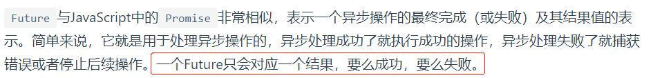

**Flutter实战**

------


### 一、起步

#### 1 跨平台技术比较


#### 2 Flutter采用dart语言的原因


#### 3 flutter框架结构


#### 4 学习资源

- flutter SDK官网：https://api.flutter.dev/index.html
- GitHub：flutter项目的issue
- **StackOverflow**网站
- Gallery源码。在Flutter源码“examples”目录下。
- 第三方库管理文档：https://pub.dev/packages


#### 5 flutter开发环境搭建


不管是window还是mac，最好都配置一下镜像：

```bash
export PUB_HOSTED_URL=https://pub.flutter-io.cn
export FLUTTER_STORAGE_BASE_URL=https://storage.flutter-io.cn
```


##### window平台下

前提条件：需安装git。


- 获取flutter SDK，官网下载：https://flutter.dev/docs/development/tools/sdk/releases
- 解压后，在Flutter安装目录的`flutter`文件下找到`flutter_console.bat`，双击运行
- 转到 “控制面板>用户帐户>用户帐户>环境变量 path”，新增flutter\bin的全路径
- 安装Android Studio。Android Studio可以管理Android 平台依赖、SDK版本。下载地址：https://developer.android.com/studio/index.html
- 运行flutter doctor查看是否还需要安装其它依赖


##### macOS平台

前提条件：


- 获取flutter SDK，官网下载：https://flutter.io/sdk-archive/#macos
- 解压，添加到path中：

```bash
cd ~/development
unzip ~/Downloads/flutter_macos_v0.5.1-beta.zip

vi $HOME/.bash_profile
export PATH=[FLUTTER_INSTALL_PATH]/flutter/bin:$PATH
// 刷新当前终端窗口
source $HOME/.bash_profile  
echo $PATH
```

- 安装Xcode


- 安装Android Studio。Android Studio可以管理Android 平台依赖、SDK版本。下载地址：https://developer.android.com/studio/index.html


##### flutter使用帮助

```bash
// 升级Flutter SDK和依赖包
// 同时更新Flutter SDK和你的flutter项目依赖包
flutter upgrade  

// 如果你只想更新项目依赖包（不包括Flutter SDK
flutter packages get 获取项目所有的依赖包。
flutter packages upgrade 获取项目所有依赖包的最新版本。
```


##### IDE设置

###### vscode配置与使用

- 安装flutter和dart插件
- 安装Code Runner插件
- 安装Awesome Flutter Snippets插件：代码补全
- 安装Flutter Widget Snippets插件：代码补全
- 安装夜神模拟器（用于虚拟机调试）：https://www.bilibili.com/video/BV1S4411E7LY?p=16

可选插件：

- Bracket Pair Colorizer插件：区分括号颜色
- Darcula设置IDE主题

使用方式：

- 创建项目，ctrl+shift+P


- vscode终端输入flutter run，运行项目
- r热重载 R重新编译项目


###### Android Studio 配置与使用

- 安装flutter和dart插件


- 创建flutter应用


- 热重载


###### 真机调试

安卓机调试：


苹果机调试：

[连接iOS真机](https://book.flutterchina.club/chapter1/install_flutter.html#_1-3-3-连接设备运行flutter应用)


###### 常见配置问题


#### 6 dart语言

##### 变量声明

###### var


###### dynamic和Object


即前者有可能会发生运行时错误。


###### final和const


##### 函数


即函数也可以作为方法的参数。在OC中是不可以的，应该使用block。


###### 函数声明


###### 箭头函数


###### 函数作为变量


###### 可选参数


###### 可选的命名参数


###### 注意


##### 异步支持


###### Feature



`Future` 的所有API的返回值仍然是一个`Future`对象，所以可以很**方便的进行链式调用**。

```dart
1. Future.then
/*
使用Future.delayed 创建了一个延时任务，即2秒后返回结果字符串"hi world!"，然后我们在then中接收异步结果并打印结果
*/
Future.delayed(new Duration(seconds: 2),(){
   return "hi world!";
}).then((data){
   print(data);
});


2. Future.catchError
Future.delayed(new Duration(seconds: 2),(){
   //return "hi world!";
   throw AssertionError("Error");  
}).then((data){
   //执行成功会走到这里  
   print("success");
}).catchError((e){
   //执行失败会走到这里  
   print(e);
});


3. Future.whenComplete
Future.delayed(new Duration(seconds: 2),(){
   //return "hi world!";
   throw AssertionError("Error");
}).then((data){
   //执行成功会走到这里 
   print(data);
}).catchError((e){
   //执行失败会走到这里   
   print(e);
}).whenComplete((){
   //无论成功或失败都会走到这里
});


4. Future.wait
/*
有些时候，我们需要等待多个异步任务都执行结束后才进行一些操作，比如我们有一个界面，需要先分别从两个网络接口获取数据，获取成功后，我们需要将两个接口数据进行特定的处理后再显示到UI界面上，应该怎么做？答案是Future.wait，它接受一个Future数组参数，只有数组中所有Future都执行成功后，才会触发then的成功回调，只要有一个Future执行失败，就会触发错误回调。
*/
Future.wait([
  // 2秒后返回结果  
  Future.delayed(new Duration(seconds: 2), () {
    return "hello";
  }),
  // 4秒后返回结果  
  Future.delayed(new Duration(seconds: 4), () {
    return " world";
  })
]).then((results){
  print(results[0]+results[1]);
}).catchError((e){
  print(e);
});
```


###### Async/await

```dart
task() async {
   try{
    String id = await login("alice","******");
    String userInfo = await getUserInfo(id);
    await saveUserInfo(userInfo);
    //执行接下来的操作   
   } catch(e){
    //错误处理   
    print(e);   
   }  
}
```


###### Stream


```dart
Stream.fromFutures([
  // 1秒后返回结果
  Future.delayed(new Duration(seconds: 1), () {
    return "hello 1";
  }),
  // 抛出一个异常
  Future.delayed(new Duration(seconds: 2),(){
    throw AssertionError("Error");
  }),
  // 3秒后返回结果
  Future.delayed(new Duration(seconds: 3), () {
    return "hello 3";
  })
]).listen((data){
   print(data);
}, onError: (e){
   print(e.message);
},onDone: (){

});
```


### 二、第一个flutter应用

#### 1 demo

```dart
import 'package:flutter/material.dart';

void main() => runApp(new MyApp());

class MyApp extends StatelessWidget {
  @override
  Widget build(BuildContext context) {
    return new MaterialApp(
      title: 'Flutter Demo',
      theme: new ThemeData(
        primarySwatch: Colors.blue,
      ),
      home: new MyHomePage(title: 'Flutter Demo Home Page'),
    );
  }
}

class MyHomePage extends StatefulWidget {
  MyHomePage({Key key, this.title}) : super(key: key);
  final String title;

  @override
  _MyHomePageState createState() => new _MyHomePageState();
}

class _MyHomePageState extends State<MyHomePage> {
  int _counter = 0;

  void _incrementCounter() {
    setState(() {
      _counter++;
    });
  }

  @override
  Widget build(BuildContext context) {
    return new Scaffold(
      appBar: new AppBar(
        title: new Text(widget.title),
      ),
      body: new Center(
        // 注意Center只是将子组件对其到屏幕中心，也就是Column
        // 但是Column组件中的子组件需要重新布局
        child: new Column(
          mainAxisAlignment: MainAxisAlignment.center,
          children: <Widget>[
            new Text(
              'You have pushed the button this many times:',
            ),
            new Text(
              '$_counter',
              style: Theme.of(context).textTheme.headline4,
            ),
          ],
        ),
      ),
      floatingActionButton: new FloatingActionButton(
        onPressed: _incrementCounter,
        tooltip: 'Increment',
        child: new Icon(Icons.add),
      ), // This trailing comma makes auto-formatting nicer for build methods.
    );
  }
}
```


##### 调用的流程


对于`StatefulWidget`，将`build`方法放在State中。


#### 2 路由管理


```dart
            FlatButton(
              child: Text("open new route"),
              onPressed: () {
                Navigator.push(context, MaterialPageRoute(builder: (context) {
                  return NewRoute();
                }));
              },
            ),
```

代码分析：

##### MaterialPageRoute


```dart
  MaterialPageRoute({
    WidgetBuilder builder,  // 函数对象？
    RouteSettings settings,
    bool maintainState = true,  
    bool fullscreenDialog = false,
  })
```


##### Navigator


常用方法：


```dart
Navigator.push(BuildContext context, Route route)
// 等价于
Navigator.of(context).push(Route route)
```


##### 路由传值

```dart
// TipRoute.dart
class TipRoute extends StatelessWidget {
  TipRoute({
    Key key,
    @required this.text,  // 可选命名参数，在使用构造函数时，默认指定的参数名就是属性名
  }) : super(key: key);
  final String text;

  @override
  Widget build(BuildContext context) {
    return Scaffold(
      appBar: AppBar(
        title: Text("提示"),
      ),
      body: Padding(
        padding: EdgeInsets.all(18),
        child: Center(
          child: Column(
            children: <Widget>[
              Text(text),
              RaisedButton(
                onPressed: () => Navigator.pop(context, "我是返回值"),
                child: Text("返回"),
              )
            ],
          ),
        ),
      ),
    );
  }
}

// main.dart
import 'TipRoute.dart';
class RouterTestRoute extends StatelessWidget {
  @override
  Widget build(BuildContext context) {
    return Center(
      child: RaisedButton(
        onPressed: () async {
          // 打开`TipRoute`，并等待返回结果
          var result = await Navigator.push(
            context,
            MaterialPageRoute(
              builder: (context) {
                return TipRoute(
                  // 路由参数
                  text: "我是提示xxxx",
                );
              },
            ),
          );
          //输出`TipRoute`路由返回结果
          print("路由返回值: $result");
        },
        child: Text("打开提示页"),
      ),
    );
  }
}
```


##### 命名路由

###### 路由表


###### 注册路由表

```dart
MaterialApp(
  title: 'Flutter Demo',
  theme: ThemeData(
    primarySwatch: Colors.blue,
  ),
  // 注册路由表
  routes:{
   "new_page":(context) => NewRoute(),
    ... // 省略其它路由注册信息
  } ,
  home: MyHomePage(title: 'Flutter Demo Home Page'),
);
```

###### 通过路由名打开新路由页


###### 命名路由参数传递

```dart
// TODO
```

###### 路由生成钩子


```dart
MaterialApp(
  ... //省略无关代码
  onGenerateRoute:(RouteSettings settings){
	  return MaterialPageRoute(builder: (context){
		   String routeName = settings.name;
       // 如果routeName已经注册，可以跳转到对象的页面
       // 如果访问的路由页需要登录，但当前未登录，则直接返回登录页路由，
       // 引导用户登录；其它情况则正常打开路由。
     }
   );
  }
);

// 捕获到Navigator.pushNamed中RouteName，即settings.name
var onGenerateRoute = (RouteSettings settings) {
  final name = settings.name;
  final Function pageContentBuilder = routes[name];

  if (pageContentBuilder != null) {  // 判断路由页面是否已经注册
    if (settings.arguments != null) {
      final Route route = MaterialPageRoute(
        builder: (context) => pageContentBuilder(context, auguments: settings.arguments),
      );
      return route;
    } else {
      final Route route = MaterialPageRoute(
        builder: (context) => pageContentBuilder(context),
      );
      return route;
    }
  }
};
```


#### 3 包管理

flutter中使用配置文件`pubspec.yaml`（位于项目根目录）来管理第三方依赖包。


基本结构：

```yaml
name: flutter_in_action
description: First Flutter application.

version: 1.0.0+1

dependencies:
  flutter:
    sdk: flutter
  cupertino_icons: ^0.1.2

dev_dependencies:
  flutter_test:
    sdk: flutter
    
flutter:
  uses-material-design: true
```


###### 引入第三方库

```yaml
dependencies:
  flutter:
    sdk: flutter

  cupertino_icons: ^0.1.0
  # 新添加的依赖
  english_words: ^3.1.3
```

###### 依赖本地包

```yaml
dependencies:
	pkg1:
        path: ../../code/pkg1
```

###### 依赖git

```yaml
# 如果软件包位于仓库的根目录中
dependencies:
  pkg1:
    git:
      url: git://github.com/xxx/pkg1.git
      
      
# 如果不是，可以使用path参数指定相对位置
dependencies:
  package1:
    git:
      url: git://github.com/flutter/packages.git
      path: packages/package1
```


#### 4 资源管理


详见《[Flutter实战](https://book.flutterchina.club/chapter2/flutter_assets_mgr.html#加载-assets)》。


#### 5 调试flutter应用

###### Dart Observatory


###### print、debugPrint、flutter logs


#### 6 flutter捕获异常

##### Dart单线程模型


##### flutter异常捕获

```dart
void collectLog(String line){
    ... //收集日志
}
void reportErrorAndLog(FlutterErrorDetails details){
    ... //上报错误和日志逻辑
}

FlutterErrorDetails makeDetails(Object obj, StackTrace stack){
    ...// 构建错误信息
}

void main() {
  FlutterError.onError = (FlutterErrorDetails details) {
    reportErrorAndLog(details);
  };
  runZoned(
    () => runApp(MyApp()),
    zoneSpecification: ZoneSpecification(
      print: (Zone self, ZoneDelegate parent, Zone zone, String line) {
        collectLog(line); // 收集日志
      },
    ),
    onError: (Object obj, StackTrace stack) {
      var details = makeDetails(obj, stack);
      reportErrorAndLog(details);
    },
  );
}
```


### 三、基础组件

#### 1 Widget（组件）

##### Widget与Element


##### StatelessWidget


##### StatefulWidget


生命周期：


##### Flutter SDK内置组件库


###### 基础组件


###### Material组件

```dart
import 'package:flutter/material.dart';
```

###### Cupertino组件

```dart
//导入cupertino widget库
import 'package:flutter/cupertino.dart';

class CupertinoTestRoute extends StatelessWidget {
  @override
  Widget build(BuildContext context) {
    return CupertinoPageScaffold(
      navigationBar: CupertinoNavigationBar(
        middle: Text("Cupertino Demo"),
      ),
      child: Center(
        child: CupertinoButton(
            color: CupertinoColors.activeBlue,
            child: Text("Press"),
            onPressed: () {}
        ),
      ),
    );
  }
}
```


#### 2 状态管理

管理原则：


##### Widget管理自身状态

```dart
// TapboxA 管理自身状态.

//------------------------- TapboxA ----------------------------------

class TapboxA extends StatefulWidget {
  TapboxA({Key key}) : super(key: key);

  @override
  _TapboxAState createState() => new _TapboxAState();
}

class _TapboxAState extends State<TapboxA> {
  bool _active = false;

  void _handleTap() {
    setState(() {
      _active = !_active;
    });
  }

  Widget build(BuildContext context) {
    return new GestureDetector(
      onTap: _handleTap,
      child: new Container(
        child: new Center(
          child: new Text(
            _active ? 'Active' : 'Inactive',
            style: new TextStyle(fontSize: 32.0, color: Colors.white),
          ),
        ),
        width: 200.0,
        height: 200.0,
        decoration: new BoxDecoration(
          color: _active ? Colors.lightGreen[700] : Colors.grey[600],
        ),
      ),
    );
  }
}
```


##### 父Widget管理子Widget的状态

案例：


```dart
// ParentWidget 为 TapboxB 管理状态.

//------------------------ ParentWidget --------------------------------

class ParentWidget extends StatefulWidget {
  @override
  _ParentWidgetState createState() => new _ParentWidgetState();
}

class _ParentWidgetState extends State<ParentWidget> {
  bool _active = false;

  void _handleTapboxChanged(bool newValue) {
    setState(() {  // 一旦被调用就会重新执行build方法
      _active = newValue;
    });
  }

  @override
  Widget build(BuildContext context) {
    return new Container(
      child: new TapboxB(
        active: _active,
        onChanged: _handleTapboxChanged,
      ),
    );
  }
}

//------------------------- TapboxB ----------------------------------

class TapboxB extends StatelessWidget {
  TapboxB({Key key, this.active: false, @required this.onChanged})
      : super(key: key);

  final bool active;
  final ValueChanged<bool> onChanged;

  void _handleTap() {
    onChanged(!active);  // 调用父widget中的方法
  }

  Widget build(BuildContext context) {
    return new GestureDetector(
      onTap: _handleTap,  // 绑定方法
      child: new Container(
        child: new Center(
          child: new Text(
            active ? 'Active' : 'Inactive',
            style: new TextStyle(fontSize: 32.0, color: Colors.white),
          ),
        ),
        width: 200.0,
        height: 200.0,
        decoration: new BoxDecoration(
          color: active ? Colors.lightGreen[700] : Colors.grey[600],
        ),
      ),
    );
  }
}
```


##### 混合状态管理

```dart
//---------------------------- ParentWidget ----------------------------

class ParentWidgetC extends StatefulWidget {
  @override
  _ParentWidgetCState createState() => new _ParentWidgetCState();
}

class _ParentWidgetCState extends State<ParentWidgetC> {
  bool _active = false;

  void _handleTapboxChanged(bool newValue) {
    setState(() {
      _active = newValue;
    });
  }

  @override
  Widget build(BuildContext context) {
    return new Container(
      child: new TapboxC(
        active: _active,
        onChanged: _handleTapboxChanged,
      ),
    );
  }
}

//----------------------------- TapboxC ------------------------------

class TapboxC extends StatefulWidget {
  TapboxC({Key key, this.active: false, @required this.onChanged})
      : super(key: key);

  final bool active;
  final ValueChanged<bool> onChanged;
  
  @override
  _TapboxCState createState() => new _TapboxCState();
}

class _TapboxCState extends State<TapboxC> {
  bool _highlight = false;

  void _handleTapDown(TapDownDetails details) {
    setState(() {
      _highlight = true;
    });
  }

  void _handleTapUp(TapUpDetails details) {
    setState(() {
      _highlight = false;
    });
  }

  void _handleTapCancel() {
    setState(() {
      _highlight = false;
    });
  }

  void _handleTap() {
    widget.onChanged(!widget.active);
  }

  @override
  Widget build(BuildContext context) {
    // 在按下时添加绿色边框，当抬起时，取消高亮  
    return new GestureDetector(
      onTapDown: _handleTapDown, // 处理按下事件
      onTapUp: _handleTapUp, // 处理抬起事件
      onTap: _handleTap,
      onTapCancel: _handleTapCancel,
      child: new Container(
        child: new Center(
          child: new Text(widget.active ? 'Active' : 'Inactive',
              style: new TextStyle(fontSize: 32.0, color: Colors.white)),
        ),
        width: 200.0,
        height: 200.0,
        decoration: new BoxDecoration(
          color: widget.active ? Colors.lightGreen[700] : Colors.grey[600],
          border: _highlight
              ? new Border.all(
                  color: Colors.teal[700],
                  width: 10.0,
                )
              : null,
        ),
      ),
    );
  }
}
```


#### 3 文本及样式

##### TextStyle

```dart
Text("Hello world",
  style: TextStyle(
    color: Colors.blue,
    fontSize: 18.0,
    height: 1.2,  
    fontFamily: "Courier",
    background: new Paint()..color=Colors.yellow,
    decoration:TextDecoration.underline,
    decorationStyle: TextDecorationStyle.dashed
  ),
);
```


##### TextSpan

```dart
Text.rich(TextSpan(
    children: [
     TextSpan(
       text: "Home: "
     ),
     TextSpan(
       text: "https://flutterchina.club",
       style: TextStyle(
         color: Colors.blue
       ),  
       recognizer: _tapRecognizer
     ),
    ]
))
```


##### DefaultTextStyle

```dart
DefaultTextStyle(
  //1.设置文本默认样式  
  style: TextStyle(
    color:Colors.red,
    fontSize: 20.0,
  ),
  textAlign: TextAlign.start,
  child: Column(
    crossAxisAlignment: CrossAxisAlignment.start,
    children: <Widget>[
      Text("hello world"),
      Text("I am Jack"),
      Text("I am Jack",
        style: TextStyle(
          inherit: false, //2.不继承默认样式
          color: Colors.grey
        ),
      ),
    ],
  ),
);
```


##### 字体


#### 4 按钮

##### RaisedButton


##### FlatButton


##### OutlineButton


##### IconButton


```dart
IconButton(
  icon: Icon(Icons.thumb_up),
  onPressed: () {},
)
```


##### 带图标的按钮


```dart
RaisedButton.icon(
  icon: Icon(Icons.send),
  label: Text("发送"),
  onPressed: _onPressed,
),
OutlineButton.icon(
  icon: Icon(Icons.add),
  label: Text("添加"),
  onPressed: _onPressed,
),
FlatButton.icon(
  icon: Icon(Icons.info),
  label: Text("详情"),
  onPressed: _onPressed,
),
```


##### 案例：圆角按钮

```dart
            RaisedButton(
              color: Colors.blue,
              highlightColor: Colors.blue[700],
              colorBrightness: Brightness.dark,
              splashColor: Colors.grey,
              child: Text("Submit"),
              // 设置形状
              shape: RoundedRectangleBorder(borderRadius: BorderRadius.circular(20.0)),
              onPressed: () {},
            )
```


#### 5 图片以及icon

##### Image组件

###### 从asset中加载图片

- 工程根目录下创建`images`目录
- 在`pubspec.yaml`中的`flutter`部分添加如下内容:

```yaml
  assets:
    - images/avatar.png
```

- 使用：

```dart
Image(
  image: AssetImage("images/avatar.png"),
  width: 100.0
);
// 或者
Image.asset("images/avatar.png",
  width: 100.0,
)
```


###### 从网络加载图片

```dart
Image(
  image: NetworkImage(
      "https://avatars2.githubusercontent.com/u/20411648?s=460&v=4"),
  width: 100.0,
)
    
Image.network(
  "https://avatars2.githubusercontent.com/u/20411648?s=460&v=4",
  width: 100.0,
)
```


###### 参数说明

```dart
const Image({
  ...
  this.width, //图片的宽
  this.height, //图片高度
  this.color, //图片的混合色值
  this.colorBlendMode, //混合模式
  this.fit,//缩放模式
  this.alignment = Alignment.center, //对齐方式
  this.repeat = ImageRepeat.noRepeat, //重复方式
  ...
})
```


##### Icon组件


#### 6 单选开关和复选框

##### Switch和Checkbox


```dart
class SwitchAndCheckBoxTestRoute extends StatefulWidget {
  @override
  _SwitchAndCheckBoxTestRouteState createState() => new _SwitchAndCheckBoxTestRouteState();
}

class _SwitchAndCheckBoxTestRouteState extends State<SwitchAndCheckBoxTestRoute> {
  bool _switchSelected=true; //维护单选开关状态
  bool _checkboxSelected=true;//维护复选框状态
  @override
  Widget build(BuildContext context) {
    return Column(
      children: <Widget>[
        Switch(
          value: _switchSelected,//当前状态
          onChanged:(value){
            //重新构建页面  
            setState(() {
              _switchSelected=value;
            });
          },
        ),
        Checkbox(
          value: _checkboxSelected,
          activeColor: Colors.red, //选中时的颜色
          onChanged:(value){
            setState(() {
              _checkboxSelected=value;
            });
          } ,
        )
      ],
    );
  }
}
```


#### 7 输入框和表单

##### TextField 文本框

关键属性：

```dart
const TextField({
  ...
  TextEditingController controller, 
  FocusNode focusNode,
  InputDecoration decoration = const InputDecoration(),
  TextInputType keyboardType,
  TextInputAction textInputAction,
  TextStyle style,
  TextAlign textAlign = TextAlign.start,
  bool autofocus = false,
  bool obscureText = false,
  int maxLines = 1,
  int maxLength,
  bool maxLengthEnforced = true,
  ValueChanged<String> onChanged,
  VoidCallback onEditingComplete,
  ValueChanged<String> onSubmitted,
  List<TextInputFormatter> inputFormatters,
  bool enabled,
  this.cursorWidth = 2.0,
  this.cursorRadius,
  this.cursorColor,
  ...
})
```

布局：

```dart
Column(
        children: <Widget>[
          TextField(
            autofocus: true,
            decoration: InputDecoration(
                labelText: "用户名",
                hintText: "用户名或邮箱",
                prefixIcon: Icon(Icons.person)
            ),
          ),
          TextField(
            decoration: InputDecoration(
                labelText: "密码",
                hintText: "您的登录密码",
                prefixIcon: Icon(Icons.lock)
            ),
            obscureText: true,
          ),
        ],
);
```

获取输入内容：


```dart
//定义一个controller
TextEditingController _unameController = TextEditingController();

TextField(
    autofocus: true,
    controller: _unameController, //设置controller
    ...
)
    
// 监听文本变化
@override
void initState() {
  //监听输入改变  
  _unameController.addListener((){
    print(_unameController.text);
  });
}
```


##### 表单

###### Form


###### TextFormFiled


###### FormState


```dart
class FormTestRoute extends StatefulWidget {
  @override
  _FormTestRouteState createState() => new _FormTestRouteState();
}

class _FormTestRouteState extends State<FormTestRoute> {
  TextEditingController _unameController = new TextEditingController();
  TextEditingController _pwdController = new TextEditingController();
  GlobalKey _formKey= new GlobalKey<FormState>();

  @override
  Widget build(BuildContext context) {
    return Scaffold(
      appBar: AppBar(
        title:Text("Form Test"),
      ),
      body: Padding(
        padding: const EdgeInsets.symmetric(vertical: 16.0, horizontal: 24.0),
        child: Form(
          key: _formKey, //设置globalKey，用于后面获取FormState
          autovalidate: true, //开启自动校验
          child: Column(
            children: <Widget>[
              TextFormField(
                  autofocus: true,
                  controller: _unameController,
                  decoration: InputDecoration(
                      labelText: "用户名",
                      hintText: "用户名或邮箱",
                      icon: Icon(Icons.person)
                  ),
                  // 校验用户名
                  validator: (v) {
                    return v
                        .trim()
                        .length > 0 ? null : "用户名不能为空";
                  }

              ),
              TextFormField(
                  controller: _pwdController,
                  decoration: InputDecoration(
                      labelText: "密码",
                      hintText: "您的登录密码",
                      icon: Icon(Icons.lock)
                  ),
                  obscureText: true,
                  //校验密码
                  validator: (v) {
                    return v
                        .trim()
                        .length > 5 ? null : "密码不能少于6位";
                  }
              ),
              // 登录按钮
              Padding(
                padding: const EdgeInsets.only(top: 28.0),
                child: Row(
                  children: <Widget>[
                    Expanded(
                      child: RaisedButton(
                        padding: EdgeInsets.all(15.0),
                        child: Text("登录"),
                        color: Theme
                            .of(context)
                            .primaryColor,
                        textColor: Colors.white,
                        onPressed: () {                            
                          // 通过_formKey.currentState 获取FormState后，
                          // 调用validate()方法校验用户名密码是否合法，校验
                          // 通过后再提交数据。 
                          if((_formKey.currentState as FormState).validate()){
                            //验证通过提交数据
                          }
                        },
                      ),
                    ),
                  ],
                ),
              )
            ],
          ),
        ),
      ),
    );
  }
}
```


#### 8 进度指示器


##### LinearProgressIndicator


##### CircularProgressIndicator


##### 自定义尺寸

```dart
// 线性进度条高度指定为3
SizedBox(
  height: 3,
  child: LinearProgressIndicator(
    backgroundColor: Colors.grey[200],
    valueColor: AlwaysStoppedAnimation(Colors.blue),
    value: .5,
  ),
),
// 圆形进度条直径指定为100
SizedBox(
  height: 100,
  width: 100,
  child: CircularProgressIndicator(
    backgroundColor: Colors.grey[200],
    valueColor: AlwaysStoppedAnimation(Colors.blue),
    value: .7,
  ),
),
```


##### 案例

实现一个进度条在3秒内从灰色变成蓝色的动画：

```dart
import 'package:flutter/material.dart';

class ProgressRoute extends StatefulWidget {
  @override
  _ProgressRouteState createState() => _ProgressRouteState();
}

class _ProgressRouteState extends State<ProgressRoute> with SingleTickerProviderStateMixin {
  AnimationController _animationController;

  @override
  void initState() {
    //动画执行时间3秒  
    _animationController =
        new AnimationController(vsync: this, duration: Duration(seconds: 3));
    _animationController.forward();
    _animationController.addListener(() => setState(() => {}));
    super.initState();
  }

  @override
  void dispose() {
    _animationController.dispose();
    super.dispose();
  }

  @override
  Widget build(BuildContext context) {
    return SingleChildScrollView(
      child: Column(
        children: <Widget>[
            Padding(
            padding: EdgeInsets.all(16),
            child: LinearProgressIndicator(
              backgroundColor: Colors.grey[200],
              valueColor: ColorTween(begin: Colors.grey, end: Colors.blue)
                .animate(_animationController), // 从灰色变成蓝色
              value: _animationController.value,
            ),
          );
        ],
      ),
    );
  }
}
```


### 四、布局类组件

