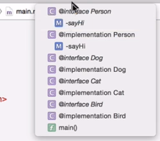
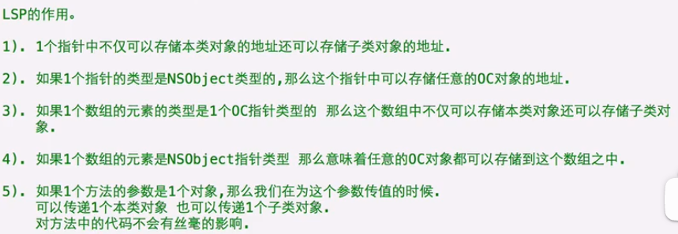
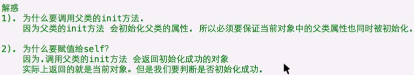
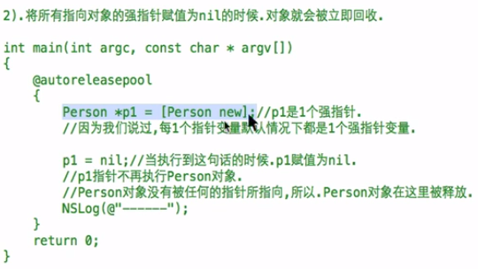
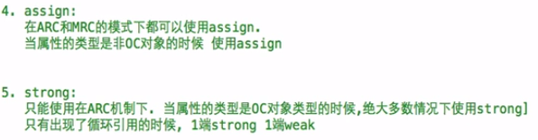
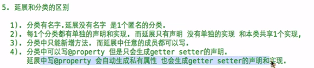

### 7 import指令

OC是**面向对象的C语言**。

源文件后缀：.m  **m代表message**，代表os中最重要的机制  **消息机制**


#include -> **#import**   预处理指令，在编译之前执行（相比c语言的变化，include的增强版）

不管使用多少次import，只会引入一次。include的话不行。

Foundation/Foundation.h  头文件    Foundation是一个框架。


**NSLog(@"")函数**   打印日志  @是格式控制   会打印时间、程序名、进程号、线程号、最后是输出信息。  会自动换行。

NSLog(@"%f",变量值) 语法是一样的。

@“hello”  **oc中的字符串NSString类型**

NSString *str=@"nihao";   // 只能存储**OC字符串常量**

NSLog(str);

NSLog(@"nihao%@",str)；  @也可以充当占位符。    @将C字符串转换为OC字符串

函数的定义与调用与C语言是一样的。


OC程序的编译、链接、执行


 OC中的数据类型   基本支持C中所有类型  新增**BOOL**（YES,NO），Boolean(0,1)，**class**，**id**类型 万能指针，**nil**（和NULL差不多），**SEL** 方法选择器，**block** 代码段。


### 16 面向过程和面向对象


类的定义（类必须有声明和定义）：

- 类的声明

  ```objective-c
  @interface 类名:NSObject
  {
      // 加上@public 关键字，则可以通过对象访问
      类的数据成员（变量一般为下划线_开头，私有属性）
  }
  方法的声明写在这里
  @end
  ```

- 类的实现

```objective-c
@implementation 类名
方法的实现写在这里
@end
```

- 创建对象

```objective-c
类名 * p = [类名 new];
```

- 使用对象，访问对象的属性

```objective-c
p->属性名=值;
(*p).属性名;
```


方法的声明实现与调用


```objective-c
方法声明： - (返回类型) 函数名;

#import <Foundation/Foundation.h>

@interface Person：NSObject
{
    NSString * _name;
    int _age;
}
- (void) run;  // 无参无返回值函数  函数名是run

// 命名规范，只有一个形参，命名为xxxWith，提高代码阅读性
- (void) eatWith:(NSString *) foodname;  // 带形参的函数，在:之后是(参数类型) 形参名称

- (int) sumWith:(int) num1 and:(int) num2;  // 带有多个形参的函数 
@end
    
@implement Person
- (void) run
{
	NSLog(@"hello");    
}

- (void) eatWith:(NSString *) foodName
{
    NSLog(@"你给我的%@真好吃",foodName);    
}

- (int) sumWith:(int) num1 and:(int) num2
{
    int num3 = num1 + num2;
    return num3;
}
@end
    
int main()
{
    Person * p = [Person new];  // 创建对象
    [p run];  // 方法调用
    [p eatWith:@"猪蹄"];  // 传入实参
    int sum = [p sumWith:10 and:20];
    NSLog(@"sum = %d",sum);
    return 0;
}
```

类的不同对象之间的毫无关系。


### 31 类加载+对象在内存中的存储


声明两个相同类的指针**只有第一次访问的时候才有类加载**。

把方法放在代码段中，使得类的不同对象共享方法的代码。


### 33 NULL与nil


### 35 分组导航标记

方法一：栏目查找



方法二：**分组导航标记**

```objective-c
#pragma mark 分组名   // 在导航条显示标题
#pragma mark -  // 显示水平线

// 建议使用
#pragma mark - 分组名  // 显示水平线，再显示标题
```


 C语言中一般称为函数，OC中类中称为方法。


**函数就算写在类的内部也可以直接调用。因为它不属于类**。所以一般不把函数写在类中。


### 38 多文件开发


可以在创建的时候选**择创建"cocoa class"**，自动生成头文件和源文件。


类可以作为方法的参数。


### 40 上帝和人的故事

```objective-c
Gender.h
// 枚举类型
typedef enum
{	
    GenderMale,
    GenderFemale
}Gender;

God.h
#import <Foundation/Foundation.h>
#import "Person.h"
#import "Gender.h"
@interface God : NSObject
{
    @public
    NSString* _name;
    int _age;
    Gender _sex;
}
- (void) killWithPerson:(Person *) p;
@end
    
    
God.m
#import "God.h"
@implementation God
- (void) killWithPerson:(Person *) p
{	
    p->leftLife = 0;
    NSLog(@"杀死%@..",p->_name);
}
@end
    
    
Person.h
#import <Foundation/Foundation.h>
#import "Gender.h"
@interface Person : NSObject
{
    @public
    NSString* _name;
    int _age;
    Gender _sex;
    int _leftLife;
}
- (void) show;
@end
    
Person.m
#import "Person.h"
@implementation Person
- (void) show
{	
    NSLog(@"我叫%@，还有%d年时间。",_leftLife);
}
@end
```


### 42 类的属性和方法

将另一个target中的模块移动到当前target，右键，"show in finder"，勾选前两项。


如果在方法中调用属性，直接使用就可以，不需要self。

```c
char ans = 'a';
rewind(stdin);  // 清除缓存
scanf("%c", &ans);
```


### 49对象与方法

类作为方法的参数，实际上就是类似"传引用"的过程。形参指针和实参指针指向的是同一个对象。

```c
// double类型的格式化是 %lf
double a=1.52;
NSLog(@"distance is %lf",a);
```


### 51 异常


因此需要对异常进行处理。

```objective-c
@try{
    
}
@catch(NSException *ex){
    // 一般写处理异常的代码
    NSLog(@"%@",ex);  // 使用%@打印对象  ex是一个指针，指向一个对象
}
@finally{
	// 无论try中是否发生异常，都会执行
}
```

无法捕获C中的异常，比如除0异常。

最常用还是使用**逻辑判断**是否回发生异常。


### 53 类方法

类方法的调用不依赖于对象，如果要调用类方法，不需要创建对象，而是直接通过类型来调用。

**类方法的声明使用"+"号**。

直接通过类名调用  **[类名 类方法名]**。

类方法的特点：不需要创建对象，节约空间；提高效率，调用类方法，直接找到类，执行类中的方法。

**类方法中不能直接访问属性、以及不能通过self调用对象方法**。因为没有创建对象。（注意只是不能通过self调用对象方法，可以调用类方法，这时self指的是当前类）。

定义类方法的时机：如果方法不需要访问属性和其他对象方法时，可以定义为类方法


关于类方法的规范：

- 如果我们**写一个类，需要为这个类提供一个和类名同名的类方法**。这个方法返回一个最纯洁的对象（也就是所有属性都是用默认值）返回。这样的话创建对象就可以使用两种方法：

```objective-c
Person.h
@interface Person : NSObject
    {
        @public
        NSString _name;
    }
	+ (instanceType)person;
    //+ (Person *)person;   一般用上面这个写法
@end

Person.m
#import "Person.h"
@implement Person
    + (Person *)person{  // 类似构造函数
        Person * p1 = [Person new];
        return p1;
    }
@end

main.m
#import <Foundation/Foundation.h>
#import "Person.h"

int main(){
    // 两种方法的含义是一样的
    Person p1=[Person new];
    Person p2=[Person person];
    return 0;
}
```


### 57 NSString


#### 常用的类方法


#### 常用的对象方法

```objective-c
// 计算字符串长度
NSString *str=@"hello";
NSUInteger len=[str length];
NSLog(@"str len=%lu",len);

// 取下标位置的字符
unichar ch=[str characterAtIndex:2];  // 返回值是两个字节
NSLog(@"%c",ch);  // 如果字符串是中文，则用大写%C

//判断字符串是否相等
NSString *str1=@"jack";
NSString *str2=@"rose";
if([str1 isEqualToString:str2]){  // 返回一个BOOL类型
    NSLog(@"相等");
}

// 比较字符串大小
NSString *str1=@"jack";
NSString *str2=@"rose";
int res=[str1 compare:str2];
```


### 59 匿名对象

没有名字的对象。没有任何指针指向这个对象。

匿名对象只能使用一次，用完就不会再使用了。

[Person new];


### 60 面向对象的三大特性

封装、继承、多态

#### setter的封装

```objective-c
@implement Person
- (void) setAge:(int) age  // set开头，属性名去掉下划线，首字母大写
{
	if(age>=0 && age<=200){
        _age=age;
    }
    else{
        _age=18;
    }
}

- (void) setName:(NSString*) name
{
    if([name length]>=2){
        _name=name;
    }
    else{
        _name=@"无名";
    }
}
@end
```


#### getter的封装

```objective-c
@implement Person
- (NSString*) name  // 一定是对象的方法
{
    return _name;
}
- (int) age
{
    return _age;
}
@end
```


#### 使用封装的时机

- 只要属性需要被外界访问，就需要为这个属性封装setter和getter方法。
- 如果只是类内访问属性，那么就不需要封装setter和getter。


### 65 对象之间的关系

常用的有：**组合、依赖、关联、继承**关系。

#### 组合

组合关系：一个类是由其他类联合起来组合而成，那么它们之间的关系就叫做组合关系。


#### 依赖

 依赖关系：一个对象的方法的参数是另外一个对象，那么它们之间的关系就是依赖关系。

比如：B类是A类方法的参数，我们就说A类依赖于B类。

耦合度：一般编程需要实现**低耦合**。

#### 关联

关联关系：一个类作为另一个的属性，但是它们不是组合的关系，而是拥有的关系。

#### 继承


父类中只定义子类中都有的数据成员。

##### 继承的特性

- 单根性：**只能继承一个父类**。
- 传递性：A继承自B，B继承自C，那么A拥有B、C的成员。

**子类不能存在和父类同名的属性**。

##### 子类在内存中的存储、方法调用过程


注意：如果子类中重写了父类的方法，那么子类的代码段中就会加入该重写的函数。

例如：student类继承person类


### 70 Xcode文档安装

需要单独安装。

离线安装方式：下载压缩包，解压（内有三个文件）复制到以下目录。


按住"option"键，并用鼠标点击关键字，可以查看详细用法。


### 71 static关键字

OC中**static关键字不能修饰类中的属性和方法**，但是可以修饰方法中的局部变量。


编写一个类一般写属性的setter、getter方法以及一个与类同名的函数（类似构造函数）。


### 72 self关键字


#### self用在对象方法中


#### self用在类方法中


**对象方法和类方法是可以重名的**。

一句话，区分好**对象方法和类方法中self**的含义。


### 78 NSObeject

所有的类的祖宗类。他有一个类方法new。


### 79 super关键字


super只能调用父类的方法，不能调用属性。

虽然使用self也可以实现调用从父类继承的方法，但是使用super来调用更加合理。


### 80 访问修饰符


```objective-c
@interface Person : NSObject
{
    @private  // 私有的
    NSString *_name;
    @protected // 保护的
    @package  // 只能在当前框架中使用
    @public  // 公有的
}
- (void) sayHi;
@end
```


如果不加访问修饰符，**默认是protected**。

访问修饰符只能用来修饰属性，不能用来修饰方法。


### 81 私有属性与私有方法

```objective-c
// 一般来说，会把属性写在@interface包含的花括号中，但是使用xcode的时候，还是会有属性提示，只是无权访问
// 为了实现真私有 可以将属性声明写在@implementation,例如
@implement Person
{
    NSString *_name;  // 这里的属性一定是私有的
}
- (void) sayHi{
    NSLog(@"hello");
}
@end
```

方法默认是公有的。

要想把方法变成私有方法，那么**只写实现不声明**就可以。


### 83 多态

#### 里氏替换

里氏替换（LSP）：子类可以替换父类的位置，并且程序的功能不受影响。




用一个父类指针指向子类对象，只能调用子类中属于父类的成员，不能调用子类的自己定义的成员。

#### 重写

重写的方式很简单，直接在子类的@implement中重写父类中的方法。


#### 多态

指的是同一个行为，对于不同的事物具体完全不同的表现形式。


### 86 description方法


### 90 结构体与类的区别

```objective-c
// Person.h
#import <Foundation/Foundation.h>
typedef enum{  // 枚举类
    GenderMale,
    GenderFeMale
} Gender;

@interface Person : NSObject
{
    NSString *_name;
    Gender _gender;
    int _age;
}
- (void) setName:(NSString *)name;
- (NSString *) name;

- (void) setGender:(Gender)gender;
- (Gender) gender;

- (void) setAge:(int) age;
- (int) age;
@end
    
// Person.m
#import "Person.h"
@implment Person
- (void) setName:(NSString *)name{
    _name=name;
}
- (NSString *) name{
    return _name;
}

- (void) setGender:(Gender)gender{
    _gender=gender;
}
- (Gender) gender{
    return _gender;
}

- (void) setAge:(int) age{
    _age=age;
}
- (int) age{
    return age;
}
@end
    
// Student.h
#import "Person.h"
@interface Student : Person
{
    NSString *_stuNumber;
    Book *_book;
}
- (void) setStuNumber:(NSString *)stuNumber;
- (NSString *) stuNumber;

- (void) setBook:(Book *)book;
- (Book *)book;
@end

// Student.m
@implement Student
- (void) setStuNumber:(NSString *)stuNumber{
    _stuNumber=stuNumber;
}
- (NSString *) stuNumber{
    return _stuNumber;
}

- (void) setBook:(Book *)book{
    _book=book;
}
- (Book *)book{
    return _book;
}
@end
    
// Book.h
#import <Foundation/Foundation.h>
typedef struct
{
    int year;
    int month;
    int day;
} Date;
@interface Book
{
    NSString *_name;
    NSString *_publisherName;
    NSString *_author;
    Date _publishDate;
}
// getter setter 方法声明

@end
    
// Book.m
#import "Book.h"
// getter setter 方法具体实现
    
//  main.m
#import <Foundation/Foundation.h>
#import "Student.h"

int main(){
    Book *b1=[Book new];
    [b1 setName:@"钢铁是怎样练成的"];
    [b1 setPublishDate:(Date){1997,12,12}];
    [b1 setPublisherName:@"人民出版社"];
    [b1 setAuthor:@"柴科夫斯基"];
    
    Student *s1=[Student new];
    [s1 setName:@"lrr"];
    [s1 setAge:24];
    [s1 setGender:GenderMale];
    [s1 setBook:b1];
    return 0;
}

```

相同点：将多个数据封装为一个整体。

不同点：结构体只能封装数据，而类不仅封装数据还可以封装行为。结构体（局部变量的情况下）分配在栈空间，对象分配在堆空间。


### 91 类的本质

isa指针返回的类型是什么？  实际上是Class类型。

 


使用类对象只能使用类方法，不能使用对象方法。


### 93 方法的本质

方法的本质是SEL消息。为对象发送一条消息。


如果方法有多个参数，那么把参数封装为一个类传入。


### 95 点语法

因为调用setter和getter来进行赋值取值太麻烦了，因此使用点语法访问属性。


点语法的原理：


```objective-c
// 造成循环的setter
- (void) setName:(NSString *)name
{
    self.name=name;
	// 会转换为[self setName:name]，死循环
}
```

注意使用点语法必须保证setter和getter方法命名符合规范。如果没有为属性封装getter和setter方法，则无法使用点语法访问。


### 96 @property和@synthesize

作用：自动生成getter和setter方法的声明。因为是声明，因此应该写在@interface中。

注意@property只是自动加了声明，实现还是要自己写。为了解决这个问题，使用@synthesize，写在类的实现中。


```objective-c
// Person.h
#import <Foundation/Foundation.h>
@interface Person : NSObject
// 因为使用@synthesize会自动再生成一份真私有属性，因此这里的属性声明实际上可以省略了
// 问题：重新声明的真私有属性显得多余
// ------------------------
{
    NSString *_name;
    int _age;
}
// ------------------------
@property NSString *name;  // name相当于传入的参数
/*
	相当于：
	- (void) setName : (NSString *)name;
	- (NSString *)name;
*/
@property int age;
@end
    
// Person.m
#import "Person.h"
@implementation Person
@synthesize name=_name,age=_age;  // 等价于下面两行
// -------------------
@synthesize name=_name; 
@synthesize age=_age;
// -------------------
@end
----------------------
@implementation Person
// 使用改进的@synthesize语法，不会声明真私有属性
// --------------------------
{
    // 重新声明一份真私有属性，注意和原来的_name/_age不一样
    NSString *name;
    int age;
}
// --------------------------
- (void) setName:(NSString *)name{
    // self->name=name;
    _name=name;
}
- (NSString *)name{
    // return name;
    return _name;
}
// age也是一样的道理
@end
    
// main.m
Person *p1 = [Person new];
p1.age = 19; // 实际上使用的是真私有属性
```


### 98 @property增强


依旧可以批量生成相同类型的属性。

```objective-c
@property NSString *name, *date;
// 同之前一样，如果需要对属性进行逻辑验证，可以重写setter或者getter方法。注意只能重写其中的一个，否则不会自动生成私有属性。
// 如果一定要重写这两个方法，那么就在@implement中声明属性也是可以的。
```


### 99 静态类型和动态类型


- 编译检查：


可以将指针的类型做转换，来达到骗过编译器的目的。

- 运行检查：


```objective-c
// 例如：
Person *p1 = @"hello";
[p1 sayHi];
// 编译检查通过，但是运行检查失败
// 编译检查时，看p1指针的类型，是Person类，有sayHi方法
// 运行检查时，对象中并没有该方法，运行出错
```


### 100 NSObject和id指针（万能指针）

NSObject指针可以指向任何OC对象。但是无法调用对象方法。

 

id万能指针：

```objective-c
id p1 = [Person new];
// 万能指针，可以指向任何OC对象
```

两者的异同：


使用id指针指向一个对象，尽管在编译检查时通过，但是如果指向的对象中确实没有调用的这个方法，那么在运行时仍然是会报错的。


### 101 instancetype


```objective-c
// Person.h
#import <Foundation/Foundation.h>
@interface Person : NSObject
{
    NSString *_name;
}
@property NSString *name;
@end
    
// Person.m
#import "Person.h"
@implement Person
// 如果返回值是id，编译不会报错，因此会有问题，使用其他类型指针也可以接收
// 使用instanceType  代表当前这个类的对象
+ (instancetype) person{  
    return [self new];  // 这样的话，继承的子类使用person方法时，就会创建子类对象而不是父类对象
}
@end
    
// Student.h
#import "Person.h"
@interface Student : NSObject
{
    NSString * _stuNumber;
}
@property NSString *stuNumber;
- (void) study;
@end
    
// Student.m
#import "Student.h"
@implement Student
- (void) study{
    NSLog(@"studying.. ");
}
@end
    
// main.m
#import <Foundation/Foundation.h>
#import "Student.h"
int main(){
    Person *p1 = [Person person];
    
    Student *s1 = [Student person];
    return 0;
}
```


### 102 动态类型检测

苹果的编译器：**LLVM**。


```objective-c
// main.m
// 有两个类，Person类和Student类，后者是前者的子类
#import <Foundation/Foundation.h>
int main(){
    Person *p1 = [Person new];
    // 调用之前判断对象是否有这个方法（对象方法）
    BOOL b1 = [p1 respondsToSelector:@selector(length)];
    if(b1 == YES){
        [p1 sayHi];
    }
    else{
        NSLog(@"NO..");
    }
    return 0;
}
```


### 103 构造方法


```objective-c
Person *p1 = [Person new];
// 等价于
Person *p1 = [[Person alloc] init];
// 因此重写init方法就可以实现不同的初始化方式
```

#### 重写init方法


在类的实现中重写init方法。重写init方法之后调用类方法new就可以实现alloc init调用。


首先调用父类的init方法，初始化父类的属性。



#### 自定义构造方法


```objective-c
// Person.h
#import <Foundation/Foundation.h>
@interface Person : NSObject
{
    NSString *_name;
    int _age;
}
@property NSString *name;
@property int age;
- (void) initWithName:(NSString *)name andAge:(int) age;
@end
    
// Person.m
#import "Person.h"
@implement Person
- (instancetype) initWithName:(NSString *)name andAge:(int) age{
    if(self = [super init]){  // 不等于nil为真
        self.name=name;
        self.age=age;
    }
    return self;
}
@end

// main.m
#import <Foundation/Foundation.h>
#import "Person.h"
int main(){
    // 想使用自定义构造方法必须使用alloc，在使用init
    Person *p1 = [[Person alloc] initWithName:@"lrr" andAge:24];
    return 0;
}
```


### 108 内存管理（MRC）

内存的作用：存储数据。

iOS底层**基于Unix**。


#### 引用计数器

每一个对象都有一个属性retainCount。


```objective-c
Person *p1 = [Person new];
Person *p2 = p1;
```


#### 内存管理的分类


##### 1.MRC(视频111)

因为Xcode默认是ARC，因此需要**关闭ARC开启MRC**。


只需要了解原理即可。

释放过程和构造相反，构造是先调用父类的构造方法，而释放是最后调用父类的释放方法。


```objective-c
// Person.h
@interface Person : NSObject
{
    NSString *_name;
}
@property NSString *name;
@end
    
// Person.m
#import "Person.h"
@implement Person
- (void) dealloc{
    // 各种操作
    [super dealloc];
}
@end
    
// main.m
// 测试引用计数器
#import <Foundation/Foundation.h>
#import "Person.h"
int main(){
    Person *p1 = [[Person alloc] init];  // 此时引用计数retainCount=1
    NSUInteger count = [p1 retainCount];
    NSLog(@"count = %lu",count);
    [p1 retain];  // 引用计数+1  返回的是对象？  
    [p1 release]; // 引用技术-1
    [p1 release];  // 引用计数为0，回收对象
    return 0;
}
```

##### 内存管理的原则


##### 野指针与僵尸对象（视频113）

野指针


僵尸对象


因此在对象被释放之后，一般将**野指针赋值为nil，这样的话访问方法或者使用点语法（本质也是调用setter、getter方法）就不会报错**，但是没有任何反应。注意：使用**nil->属性**一定会报错。

僵尸对象的实时检查机制在debug的时候可以打开，release的时候关闭。


#### 单个对象的内存管理


#### @setter方法的内存管理


1.存在的问题：如果为Person对象赋新的Car属性（换一辆车），会发生内存泄漏。旧车的内存无法释放。

改进：


```objective-c
- (void) setter(Car *)car{
	[_car release];  // 传入的是nil也没事,不会报错
    _car = [car retain];
}
```

2.存在的问题：自我赋值。如果传入的Car对象只是修改了的属性的旧对象，由于setter方法会先释放对象，因此会导致Person对象的_car指针变成野指针。


#### @property


```objective-c
// 用法举例
@property(nonautomic,retain,readwrirte,getter=xxx,setter=xyz:) NSString *name; 
// xxx是自定义的方法名称
// 注意setter方法是带参数的，要加上冒号

// mian.m
Person *p1 = [Person new];
NSString *tmp = p1.name;
// 尽管getter方法不是name而是xxx，使用点语法还是可以调用到getter方法的
```

##### 多线程相关的参数


##### setter方法相关的参数


##### 与只读、读写相关的封装


##### 生成setter、getter方法名字相关的参数


### 123 @class


 

```objective-c
// Book.h
#import <Foundation/Foundation.h>
#import "Person.h"
@interface Book : NSObject
@property(nonatomic,retain) NSString *name;
@property(nonatomic,retain) Person *owner;

- (void) castzhishi;
@end
    
// Book.m
#import "Book.h"
@implement Book
- (void) dealloc{
    NSLog(@"书被烧了");
    [_name release];
    [_owner release];
    [super dealloc]; 
}
- (void) castzhishi{
    NSLog(@"书中自有黄金屋。");
}
@end
    
// Person.h
#import <Foundation/Foundation.h>
@class Book;
@interface Person : NSObject
@property(nonatomic,retain) NSString *name;
// 解决相互引用
@property(nonatomic,assign) Book *book;  

- (void) read;
@end

// Person.m
#import "Person.h"
#import "Book.h"  // 在这里引入头文件
@implement Person
- (void) dealloc{
    NSLog(@"人死了");
    [_name release];
    // [_book release];  上面使用assign的话就不需要release了
    [super dealloc];
}

- (void) read{
    [_book castZhiShi];
    NSLog(@"好知识");
}
@end
    
// 实际上还是有问题的，如果person对象的book属性被销毁，person对象的book指针将变成野指针。
```


 

### 126 自动释放池


```objective-c
autoreleasepool{
    Person *p1 = [[Person new] autorelease];
}
// 等价
Person *p1 = [Person new];
autoreleasepool{
    [p1 autorelease];
}
// 省去使用[p1 release];
```

#### 使用注意


### 128 类方法使用的规范


```objective-c
// Pig.h
#import <Foundation/Foundation.h>
@interface Pig : NSObject
@property(nonatomic,retain) NSString *name;
@property(nonatomic,assign) int age;
@property(nonatomic,assign) float weight;
- (instancetype) initWithName:(NSString *) name andAge:(int) age andWeight:(float) weight;
+ (intancetype) pig;
+ (instancetype) pigWithName:(NSString *) name :(int) age andWeight:(float) weight;
@end
    
// Pig.m
#import "Pig.h"
@implement Pig
- (void) dealloc{
    [_name release];
    [super dealloc];
}
- (instancetype) initWithName:(NSString *) name andAge:(int) age andWeight:(float) weight{
    if(self = [super init]){
        _name = name;
        _age = age;
        _weight = weight;
    }
    return self;
}
+ (intancetype) pig{
    return [[[self alloc] init] autorelease];
}
+ (instancetype) pigWithName:(NSString *) name andAge:(int) age andWeight:(float) weight{
    return [[[self alloc] initWithName:name andAge:age andWeight:weight] autorelease];
}
@end
    
// main.m
#import <Foundation/Foundation.h>
#import "Pig.h"
int main(){
    autorelease{
        Pig *p1 = [[[Pig alloc] initWithName:@"lrr" andAge:24 andWeight:110.2] autorelease];
        Pig *p2 = [Pig pigWithName:@"lrr" andAge:24 andWeight:110.2];  // 推荐使用
    }
    return 0;
}
```


### 129 微博练习


```objective-c
// Account.h
#import <Foundation/Foundation.h>
typedef struct{
    int year;
    int month;
    int day;
} CZDate;
@interface Account : NSObject
@property(nonatomic,retain) NSString *userName;
@property(nonatomic,retain) NSString *password;
@property(nonatomic,assign) Date registDate;
@end

// Account.m
#import "Account.h"
@implement Account
- (void) dealloc{
    NSLog(@"账户注销了");
    [_userName release];
    [_password release];
    [super dealloc];
}
@end
  
    
// User.h
#import <Foundation/Foundation.h>
#import "Account.h"
@interface User : NSObject
@property(nonatomic,retain) NSString *nickName;
@property(nonatomic,retain) CZDate birthday;
@property(nonatomic,retain) Account *account;
@end
    
// User.m
#import "User.h"
@implement User
- (void) dealloc{
    NSLog(@"用户挂了");
    [_nickName release];
    [_account release];
    [super dealloc];
}
@end
   
    
// MicroBlog.h
#import <Foundation/Foundation.h>
#import "User.h"
@interface MicroBlog : NSObject
@property(nonatomic,retain) NSString *content;
@property(nonatomic,retain) NSString *imgURL;
@property(nonatomic,assign) CZDate *sendTime;
@property(nonatomic,retain) User *user;
@property(nonatomic,retain) MicroBlog *zhuanfaBlog;
@end
    
// MicroBlog.m
#import "MicroBlog.h"
@implement MicroBlog
- (void) dealloc{
    NSLog(@"微博销毁了");
    [_content release];
    [_imgURL release];
    [_user release];
    [zhuanfaBlog release];
    [super dealloc];
}
@end
    
// main.m
#import <Foundation/Foundation.h>
#import "MicroBlog.h"
int main(){
    @autoreleasepool{
        Account *a1 = [[Account new] autorelease];
        a1.userName = @"lrr";
        a1.password = @"123456";
        a1.registDate = (CZDate){2021,4,24};
        
        User *lrr = [[User new] autorelease];
        lrr.nickName = @"scutlrr";
        lrr.birthday = (CZDate){1997,11,16};
        lrr.account = a1;
        
        MicroBlog *b1 = [[MicroBlog new] autorelease];
        b1.content = @"today is a good day";
        b1.imgURL = @"https://www.itcast.cn/logo.gif";
        b1.user = lrr;
        b1.zhuanfaBlog = nil;
        
        Account *a2 = [[Account new] autorelease];
        a2.userName = @"kk";
        a2.password = @"123456";
        a2.registDate = (CZDate){2021,4,24};
        
        User *kk = [[User new] autorelease];
        kk.nickName = @"scutkk";
        kk.birthday = (CZDate){1997,5,20};
        kk.account = a2;
        
        MicroBlog *b2 = [[MicroBlog new] autorelease];
        b2.content = @"today is a good day";
        b2.imgURL = @"https://www.itcast.cn/logo.gif";
        b2.user = kk;
        b2.zhuanfaBlog = b1;
    }
    return 0;
}
```


### 130 内存管理（ARC）


不再需要手动写retain,release,autorelease.


#### 强指针和弱指针


```objective-c
__strong Person *p1 = [Person new];  // 默认是强指针
__weak Person *p2 = p1;  // p2是弱指针
p1 = nil;  // p1不再指向对象，那么对象会立即被回收，p2是弱指针
```

#### 单个对象的内存管理




只要对象还有强指针指向，对象就不会回收。


**在ARC机制下，当对象被回收时，原来指向这个对象的<u>弱指针会被自动设置为nil</u>  **。


#### 多个对象的内存管理

##### @property参数strong和weak


##### 使用建议


#### 循环引用问题

```objective-c
// Book.h
#import <Foundation/Foundation.h>
#import "Person.h"
@interface Book : NSObject
// 会发生循环引用
// @property(nonatomic,strong) Person *owner;
// 解决方式：一方换成weak
@property(nonatomic,weak) Person *owner;  
@end
    
// Book.m
#import "Book.h"
@implement Book
- (void) dealloc{
    NSLog(@"书被烧了");
}
@end
    
// Person.h
#import <Foundation/Foundation.h>
@class Book;
@interface Person : NSObject
@property(nonatomic,strong) Book *book;  
@end

// Person.m
#import "Person.h"
#import "Book.h" 
@implement Person
- (void) dealloc{
    NSLog(@"人死了");
}
@end
```


#### @property参数总结





#### ARC与MRC的相互兼容（135）

只需要编译.m文件，因为已经包含了.h文件。


#### 将MRC程序转换为ARC程序（136）

不要轻易的进行转换。


#### ARC垃圾回收


### 137 分类（category）


做法：

新建一个文件，选择创建oc文件而不是cocoa，类型是Category，继承自想分为多个模块的那个类。

实质上就是为Student新增一个分类，分类的方法都属于一个类，就是Student。


```objective-c
// Student.h
#import <Foundation/Foundation.h>
@interface Student : NSObject
- (void) haha;
@end
    
// Student.m
#import "Student.h"
@implement Student
- (void) haha{
    NSLog(@"hahahahaha");
}
@end
    
// Student+itcast.h
#import "Student.h"
@interface Student (itcast)
- (void) hehe;
@end
    
// Student+itcast.m
#import "Student+itcast.h"
@implement Student (itcast)
- (void) hehe{
    NSLog(@"hehehe");
}
@end
    
// main.m
#import "Student.h"
#import "Student+itcast.h"
Student *s1 = [Student new];
[s1 haha];
[s1 hehe];
```

#### 使用注意

在分类中不能增加属性。


#### 使用分类的时机


### 140 非正式协议

  


### 143 block与协议

#### 延展（Extension）

##### 延展的实现





##### 使用场景


### block